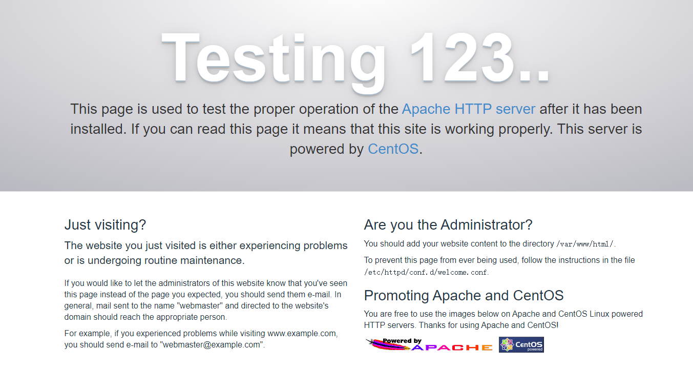
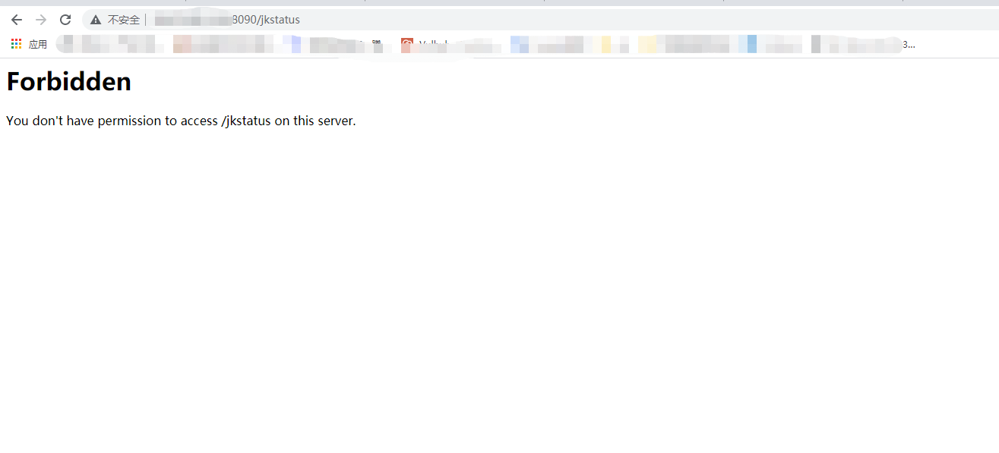

# apache mod_jk Connector访问控制绕过漏洞
## 漏洞描述
apache mod_jk Connector访问控制绕过漏洞  
由于httpd和Tomcat在路径处理规范上存在差异，因此可以绕过Apache mod_jk Connector 1.2.0版本到1.2.44版本上由JkMount httpd指令所定义端点的访问控制限制。
  
version:Apache mod_jk Connector 1.2.0 ~ 1.2.44
## 启动
`docker-compose up -d`  

`http://localhost:8090`  

 
## writeup

访问`http://localhost:8090/jkstatus`，显示403，在url后加上；即可绕过。
  

## 复现结果

