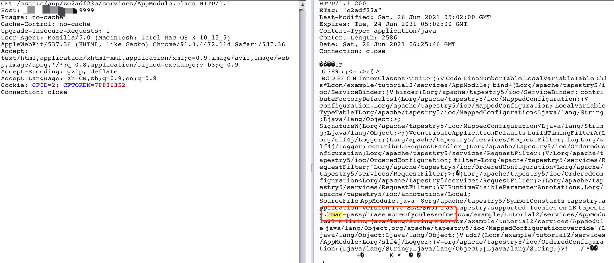

# Tapestry 任意文件读取--> RCE（CVE-2019-0195）

## Tapestry

Apache旗下的一款Java Web应用程序框架，使用MVC架构的同时，在视图层加上了模版设计理念，使其与JSP分离，即使你不懂JSP，也能使用Tapestry编写出Web应用。

## Tapestry HMAC Key

5.3.6版本引入的一个机制，用途是对序列化的数据进行加密，Tapestry的所有序列化数据传输都需要使用HMAC Key进行加密，一旦密钥泄漏，攻击者即可发送恶意payload，从而造成RCE（原理和shiro默认key的反序列化RCE相似）

HMAC Key需要开发者手动设置，默认值为空（但是不设置，Tapestry会让你编译不通过），一般都存放在 services/AppModule.class文件中（开发者也可以根据喜好存放在其他class文件中）

## CVE-2019-0195

一个任意文件下载漏洞，能下载到 AppModule.class，拿到HMAC key

### 复现

- 运行漏洞环境

```
docker-compose up -d
```

- 读取 AppModule.class

```
http://xxxx:9999/assets/something/services/AppModule.class
```



可以看到已经获取到HMAC Key

接下来，攻击者就可以使用HMAC Key，对恶意payload进行加密，发送给Tapestry服务器，Tapestry经过，解密，反序列化，从而触发恶意代码执行。恶意代码执行就不复现了，有兴趣的可以参考

```
https://github.com/kahla-sec/CVE-2021-27850_POC
```

### 修复

针对这个问题，Tapestry官方给出的修复方案是 黑名单中加入 ".class", ".properties", ".xml"，禁止这三种后缀的文件被下载

## CVE-2021-27850

针对 CVE-2019-0195 修复的绕过，下载的文件后加个"/"，即可绕过黑名单限制

- payload

```
http://xxxx:9999/assets/something/services/AppModule.class/
```

拿到AppModule.class --> 获取HMAC Key --> 构造并加密payload --> RCE


