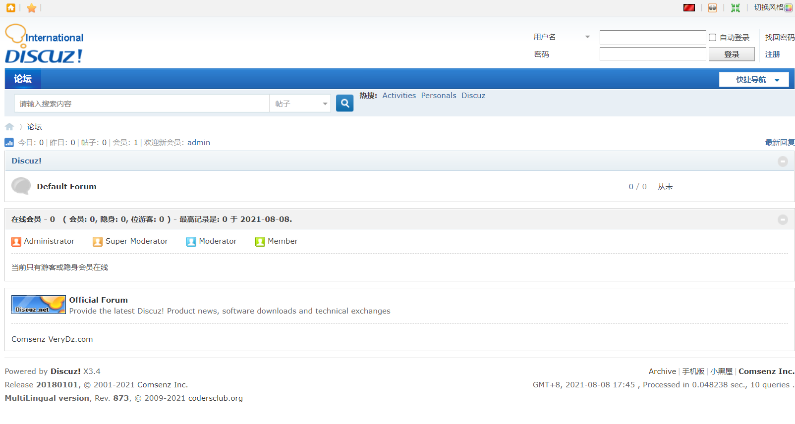

# discuz!ML RCE漏洞
## 漏洞描述
discuz!ML RCE漏洞  
该漏洞存在discuz ml(多国语言版)中,cookie中的language可控并且没有严格过滤,导致可以远程代码执行。  
version:3.2-3.4
## 启动
`docker-compose up -d`

启动镜像后访问`http://localhost:8090`,自动跳转至安装页面，设置密码后一路下一步即可。  

  

## writeup  
随意页面进行抓包，之后将cookie中的language值进行修改，格式为：`'.phpinfo().';`

## 复现结果
  
