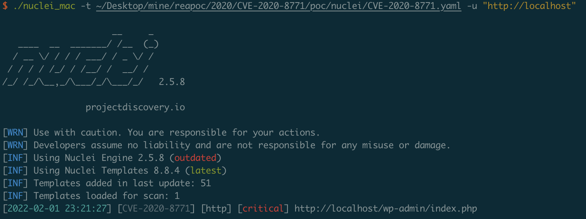

# CVE-2020-8771

## Vuln App

```
docker-compose up -d
docker-compose run --rm wp-cli install-wp
```

## Admin Page

Visit http://localhost/wp-admin

Username/Password: wordpress/wordpress

## Poc

[poc](poc/nuclei/CVE-2020-8771.yaml)


