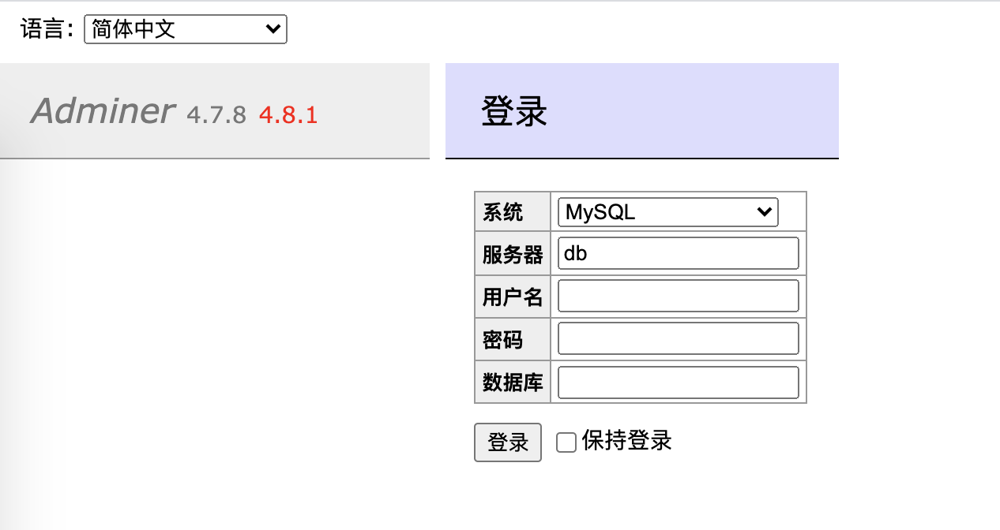
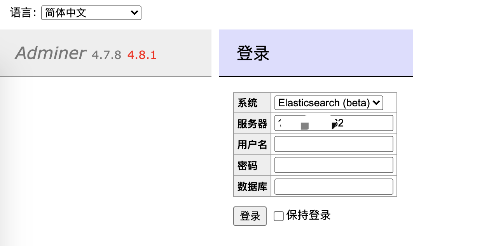
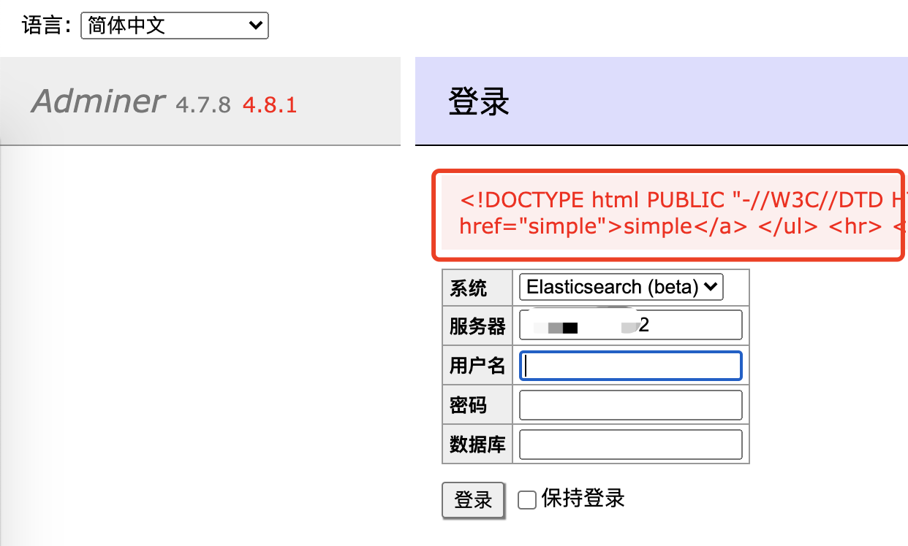
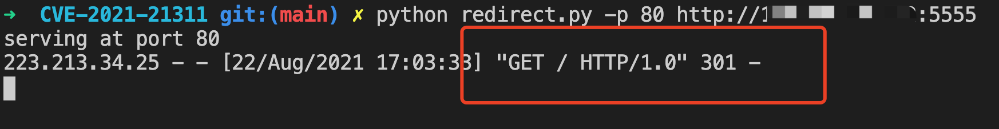
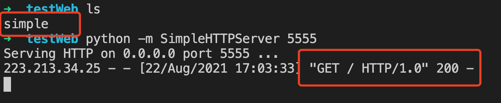

## Adminer

Adminer 是一个类似于 phpMyAdmin 的 MySQL 管理客户端。整个程序只有一个 PHP 文件，易于使用和安装。Adminer 支持多语言（已自带11种翻译语言文件，可以按自己的需求翻译相应的语言）

## 漏洞版本

< 4.7.9

## 漏洞简述

此漏洞可利用 Adminer 发送任意get请求，并从内部服务器获取响应的结果。若内部存在AWS 元数据等敏感信息，将会导致信息泄漏。

## 复现

1. 启动有漏洞的 adminer 环境

```
docker-compose up -d
```

访问 http://a.a.a.a:8080，即可访问页面



2. 被攻击vps上安装es

快速搭建的方法当然是拉起一个docker

```
docker network create somenetwork
docker run -d --name elasticsearch --net somenetwork -p 9200:9200 -p 9300:9300 -e "discovery.type=single-node" elasticsearch:6.8.11
```

3. 随便拉起一个simple http server（任意vps, ip-->x.x.x.x）

```
python -m SimpleHTTPServer 5555
```

4. 被攻击vps上拉起一个端口转发脚本

```
python redirect.py -p 80 http://x.x.x.x:5555
```

5. 在第一步中的 Adminer 页面中

选择elasticsearch，填入es连接ip



点击登陆，即可返回simple http server内容，ssrf成功






