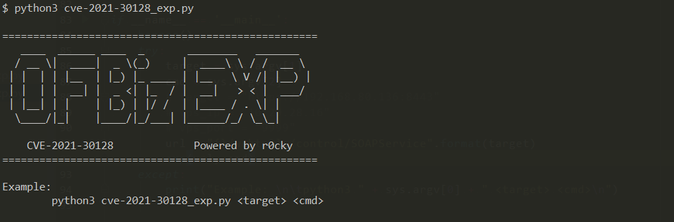
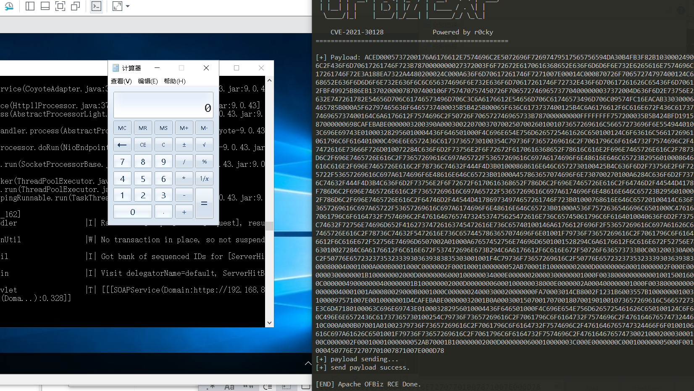

# CVE-2021-30128

ofbiz-cve_2021_30128

## Run Vuln

```
docker-compose up -d
```

## Stop Vuln

```
docker-compose down -v
```

## CVE-2021-30128

**CVE-2021-30128 Apache OFBiz 反序列化漏洞远程命令执行**

> **本文以及工具仅限技术分享，严禁用于非法用途，否则产生的一切后果自行承担。**

工具暂未完善，目前gadget是写死的

### 远程命令执行EXP

#### 执行python exp脚本

```shell
python3 cve-2021-30128_exp.py <target> <cmd>
```

#### 示例




