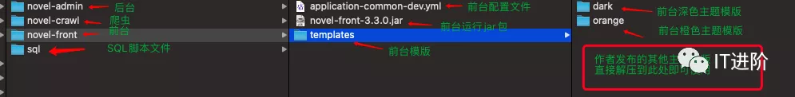
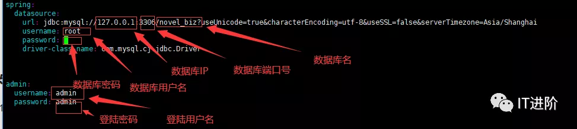
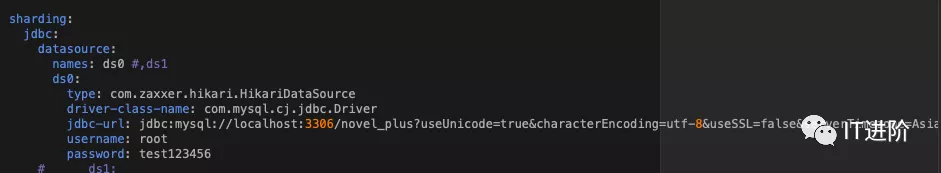

# novel-plus

小说精品屋-plus是在小说精品屋的基础上，去除了漫画和弹幕模块，专注于小说，是一个多端（PC、WAP）阅读、功能完善的原创文学CMS系统，由前台门户系统、作家后台管理系统、平台后台管理系统、爬虫管理系统等多个子系统构成，支持会员充值、订阅模式、新闻发布和实时统计报表等功能。

## 硬件要求

```
CPU：1核+
内存：1G+
硬盘：20G+
```

## 安装文件下载上传

链接: https://pan.baidu.com/s/1VXx38rkT4bE2jx8vbKMVAQ 提取码: g1hd

下载安装文件，并上传到服务器上，运行unzip novel-plus-install-v3.5.0.zip 命令解压压缩包得到novel-plus-install-v3.5.0文件夹。

解压后的各文件夹说明（3.5.0的配置文件略有不同）：



## Mysql安装配置

1. Linux环境下Mysql安装教程。（https://www.runoob.com/mysql/mysql-install.html）

2. 修改Mysql的max_allowed_packet配置（建议100M）：（https://blog.csdn.net/qq_34988304/article/details/92762504）

3. 连接Mysql服务，创建数据库novel_plus（可自定义数据库名）：create database novel_plus default character set utf8mb4 collate utf8mb4_general_ci 。

4. 导入novel-plus-install-v3.5.0/sql/novel_plus.sql文件。

## JDK安装配置

JDK1.8安装配置教程：https://blog.csdn.net/github_38336924/article/details/82221258

## 运行爬虫管理系统

1. 进入novel-plus-install-v3.5.0/novel-crawl目录下，修改application-common-prod.yml配置文件中的数据库配置（2.5.0之后版本如果开启了分表功能则修改的是第二张图上面的数据库配置）和登陆配置。





2. 进入novel-plus-install-v3.5.0/novel-crawl目录下,运行setsid java -jar -Dspring.profiles.active=prod novel-crawl-3.5.0.jar命令启动程序。

3. 放行8083端口号。

4. 浏览器访问（启动程序后大约几秒～几十秒即可访问），默认端口号8083。

## 运行前台门户网站

1. 进入novel-plus-install-v3.5.0/novel-front目录下，修改application-common-prod.yml配置文件中的数据库配置（配置方式同上）和图片保存方式。

2. 修改application-website.yml配置文件中的网站信息配置。

```
#网站配置
website:
  #网站名
  name: 小说精品屋
  #域名
  domain: xiongxyang.gitee.io/home
  #SEO关键词
  keyword: ${website.name},小说,小说CMS,原创文学系统,开源小说系统,免费小说建站程序
  #SEO描述
  description: ${website.name}是一个多端（PC、WAP）阅读、功能完善的原创文学CMS系统，由前台门户系统、作家后台管理系统、平台后台管理系统、爬虫管理系统等多个子系统构成，支持会员充值、订阅模式、新闻发布和实时统计报表等功能，新书自动入库，老书自动更新。
  #联系QQ
  qq: 1179705413
```

3. 修改application-common-prod.yml配置文件中的模版名为你需要使用的模版名（templates文件夹下的模版文件夹名）（内置orange/dark/blue等多套模版）。 

```
#模版配置
templates:
  #模版名
  name: orange
```

4. 进入novel-plus-install-v3.5.0/novel-front目录下,运行setsid java -jar -Dspring.profiles.active=prod novel-front-3.5.0.jar 命令启动程序。

5. 放行8085端口号。

6. 浏览器访问（启动程序后大约几秒～几十秒即可访问），默认端口号8085。

## 低版本升级指南

- 爬虫管理系统升级

替换最新的jar文件。

重命名配置文件application-common-dev.yml为application-common-prod.yml。

启动命令更新为setsid java -jar -Dspring.profiles.active=prod novel-crawl-3.5.0.jar。

重启程序（启动程序后大约几秒～几十秒即可访问）。


- 前台门户网站升级

替换最新的jar文件。

替换最新的模版文件夹templates。

重命名配置文件application-common-dev.yml为application-common-prod.yml。

启动命令更新为setsid java -jar -Dspring.profiles.active=prod novel-front-3.5.0.jar 。

重启程序（启动程序后大约几秒～几十秒即可访问）。

- 后台管理系统升级

替换最新的jar文件。

重命名配置文件application-dev.yml为application-prod.yml。

启动命令更新为setsid java -jar -Dspring.profiles.active=prod novel-admin-3.5.0.jar 。

重启程序（启动程序后大约几秒～几十秒即可访问）。