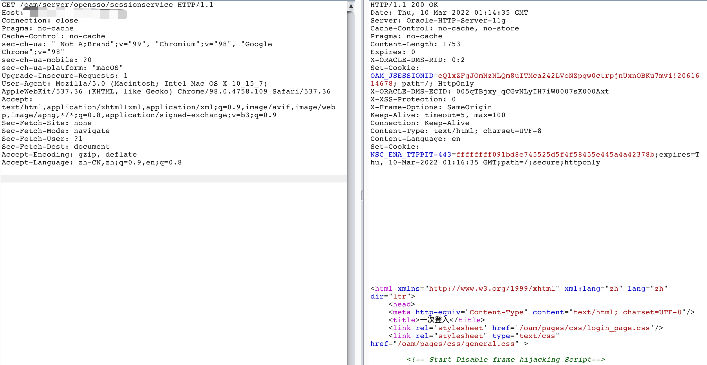
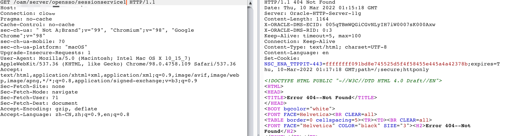
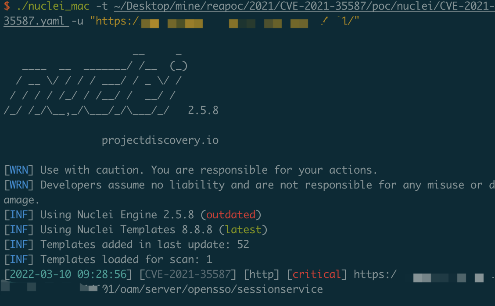

# Oracle Access Manager RCE

In the recent patch of OAM 12c, they dropped support for OpenSSO, so the entrypoint "/oam/server/opensso/sessionservice" is also removed by accident. But not for the OAM 11g.

So we just have to test if "/oam/server/opensso/sessionservice" exists

Test on Version 12c and 11g

## Poc

[Poc](../poc/nuclei/CVE-2021-35587.yaml)

