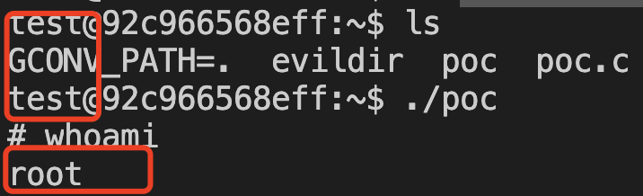

# CVE-2021-4034

## Get Vuln

```
docker pull vultarget/polkit_local_privilege_escalation-cve_2021_4034
```

## Run Vuln

```
docker run -it vultarget/polkit_local_privilege_escalation-cve_2021_4034 bash
```

## Change to User test

```
su test
```

```
cd /home/test
```

## Exploit

```
./poc
```


