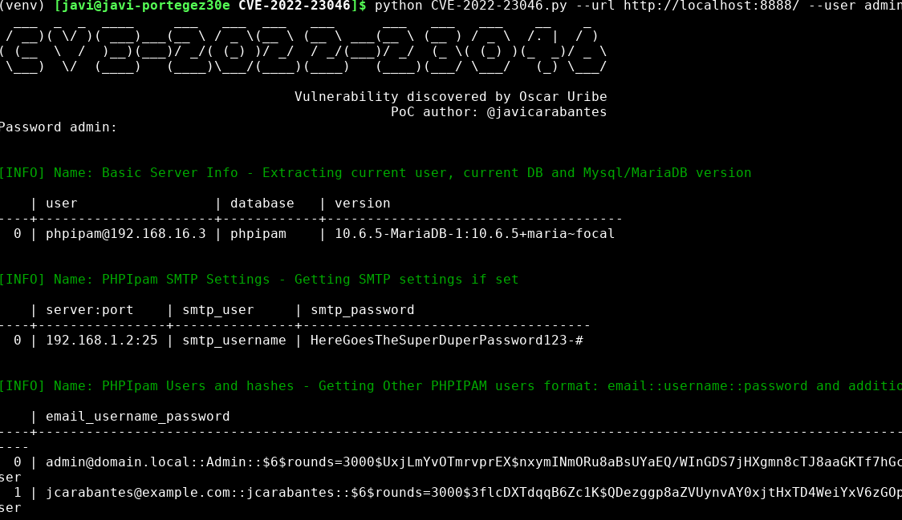

# CVE-2022-23046
The original discovery and manual PoC is from [Fluidattacks](https://fluidattacks.com/advisories/mercury/):

PhpIPAM v1.4.4 allows an authenticated admin user to inject SQL sentences in the "subnet" parameter while searching a subnet via app/admin/routing/edit-bgp-mapping-search.php.

This PoC executes some easy SQLi to fetch info like:

- Basic Server Info
- SMTP Settings
- Other authentication method like AD/LDAP/Radius
- PHPIpam Users and hashes
- MySQL db Users
- Other schemas availables

Some of them are accessible through the backend but I added here just as an easy way to fetch all the information in a single query. Feel free to add/remove your own payloads

For more advanced stuff, create your own payloads (in res.payloads), use burpsuite or use sqlmap.

## Vuln App

```
docker-compose up -d
```

# Installation

```bash
git clone https://github.com/jcarabantes/CVE-2022-23046.git
python -m venv venv
source venv/bin/activate
pip install -r requirements.txt

python CVE-2022-23046.py -h
```

# Quick usage
```bash

python CVE-2022-23046.py -h
  ___  _  _  ____     ___   ___  ___   ___      ___   ___   ___    __    _  
 / __)( \/ )( ___)___(__ \ / _ \(__ \ (__ \ ___(__ \ (__ ) / _ \  /. |  / ) 
( (__  \  /  )__)(___)/ _/( (_) )/ _/  / _/(___)/ _/  (_ \( (_) )(_  _)/ _ \
 \___)  \/  (____)   (____)\___/(____)(____)   (____)(___/ \___/   (_) \___/

                                     Vulnerability discovered by Oscar Uribe
                                                 PoC author: @javicarabantes
usage: CVE-2022-23046.py [-h] [-d] [-q] --url URL --user USER

optional arguments:
  -h, --help   show this help message and exit
  -d           Debug output
  -q           Do not print the banner
  --url URL    phpipam url: https://ipamserver:8081/
  --user USER  admin user


python CVE-2022-23046.py --url http://localhost:8888/ --user admin
```




# Additional info
I've been testing this PoC in different phpipam versions 1.4.3, 1.4.4 and 1.5 which worked fine (not only < 1.4.5).
Checking at the phpipam github project I saw that the commit 4b764b9cb236d1a4a06fc8ad9a93b306b3f5c04d also affected version 1.5

Usefull file: https://github.com/phpipam/phpipam/blob/master/misc/CHANGELOG

Check if CHANGELOG is accessible and has the comment about this fix, otherwise the phpipam server may be vulnerable

> curl -sk https://phpipamserver/misc/CHANGELOG | grep "edit-bgp-mapping-search.php"
