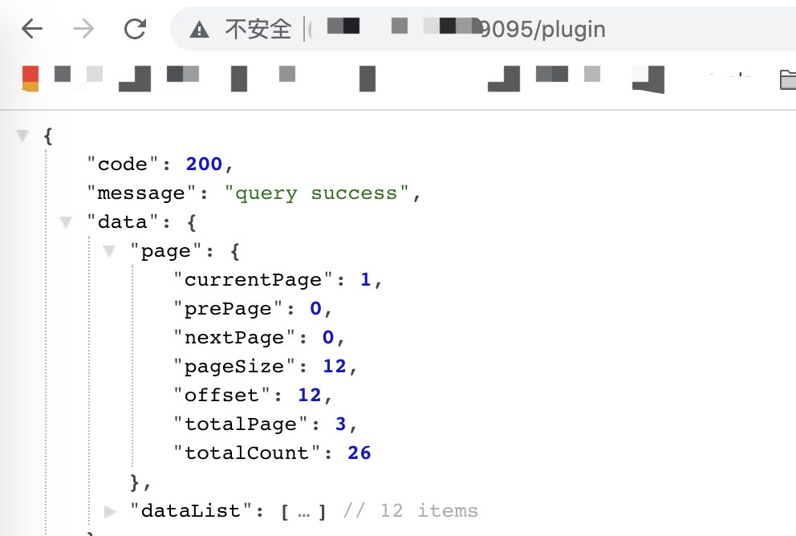
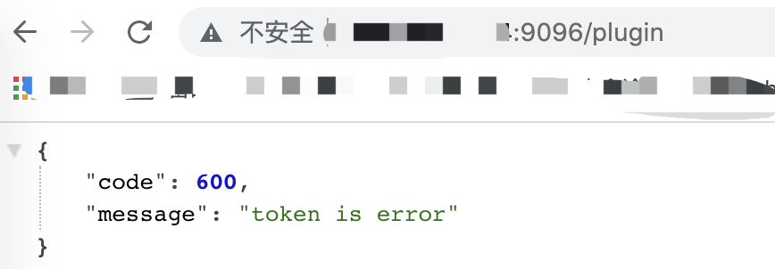
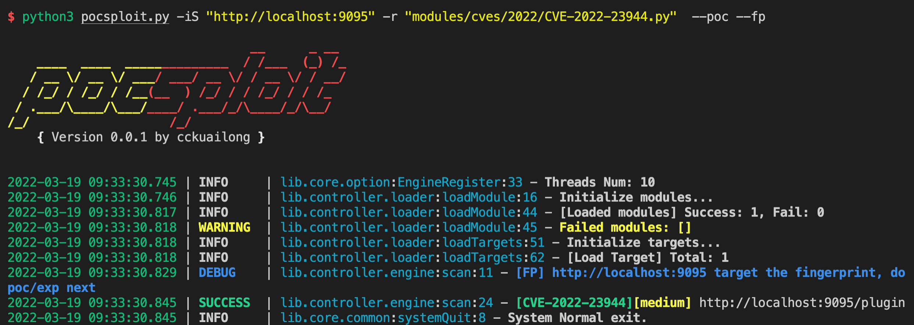

# CVE-2022-23944

User can access /plugin api without authentication. This issue affected Apache ShenYu 2.4.0 and 2.4.1.

## Vuln App

```
docker-compose up -d
```

## Poc

vuln app:



version >= 4.2, return 600



[Poc](../poc/pocsploit/CVE-2022-23944.py)

