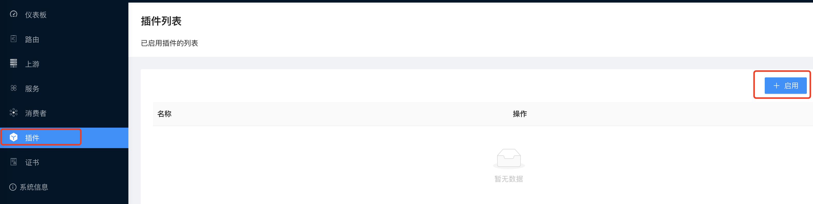
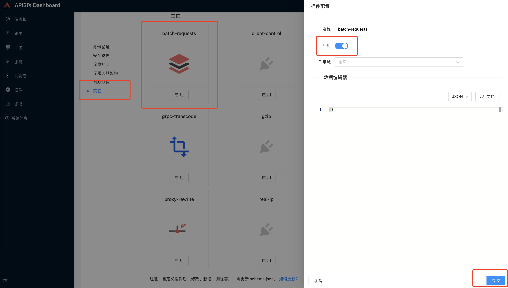
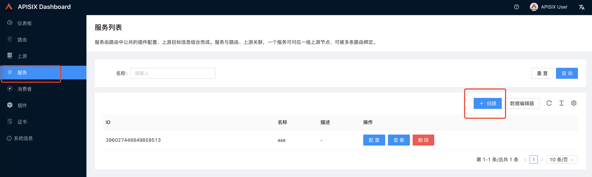
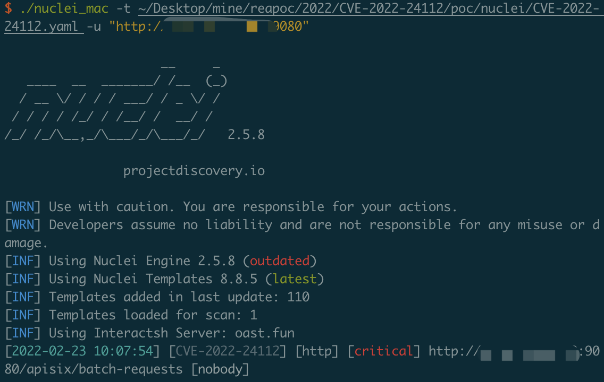
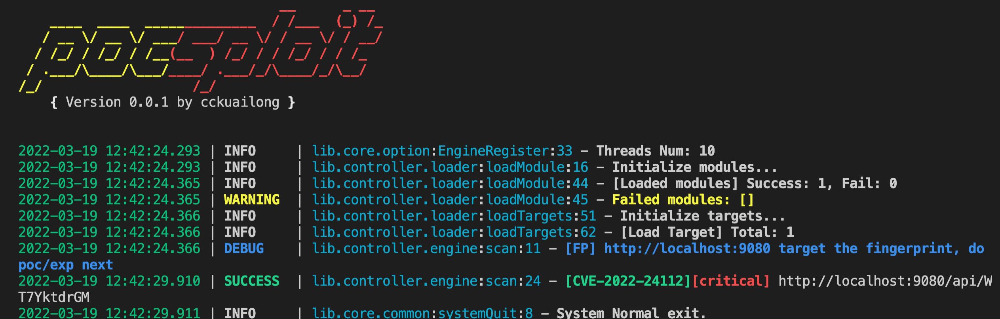

# CVE-2022-24112

Apache APISIX apisix/batch-requests plugin allows overwriting the X-REAL-IP header to RCE;An attacker can abuse the batch-requests plugin to send requests to bypass the IP restriction of Admin API. A default configuration of Apache APISIX (with default API key) is vulnerable to remote code execution. When the admin key was changed or the port of Admin API was changed to a port different from the data panel, the impact is lower. But there is still a risk to bypass the IP restriction of Apache APISIX's data panel. There is a check in the batch-requests plugin which overrides the client IP with its real remote IP. But due to a bug in the code, this check can be bypassed.

## Vuln App

```
docker-compose up -d
```

Visit http://xxx:9000, login with admin / admin



Enable the plugin



creat a service



## Poc

[Poc1](../poc/nuclei/CVE-2022-24112.yaml)



[Poc2](../poc/pocsploit/CVE-2022-24112.py)


