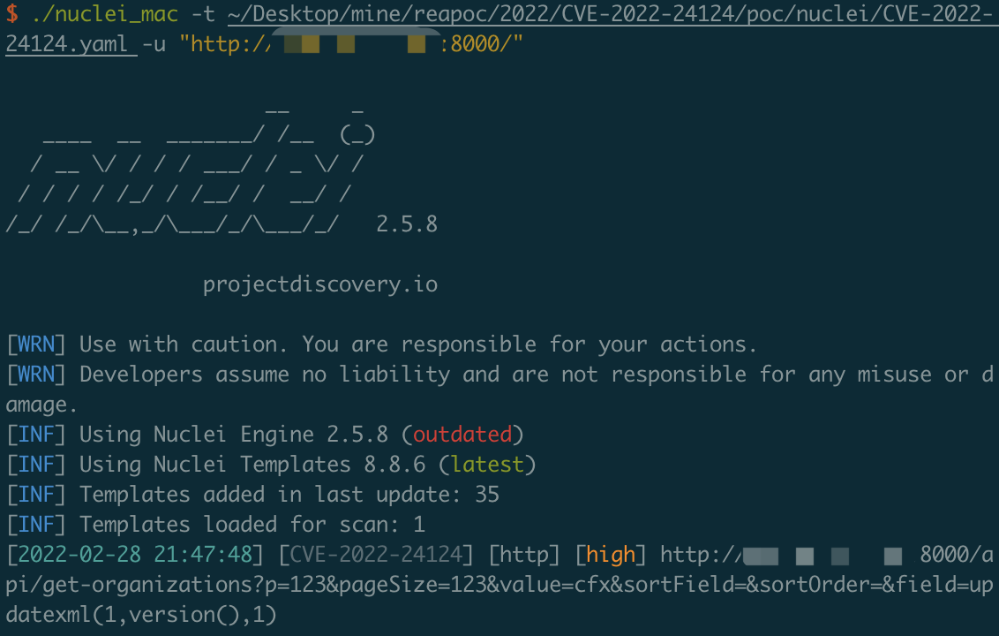

# CVE-2022-24124

The query API in Casdoor before 1.13.1 has a SQL injection vulnerability related to the field and value parameters, as demonstrated by api/get-organizations.

## Vuln App

```
docker-compose up -d
```

Visit http://xxx:8000

## Poc

[](../poc/nuclei/CVE-2022-24124.yaml)


