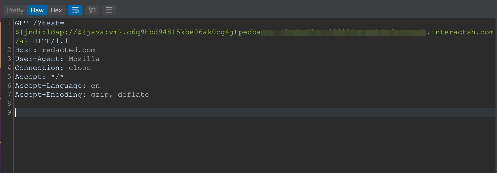
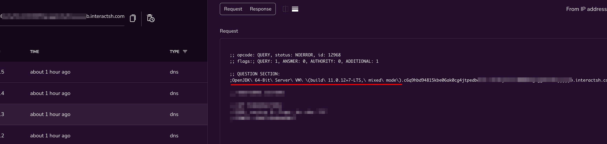
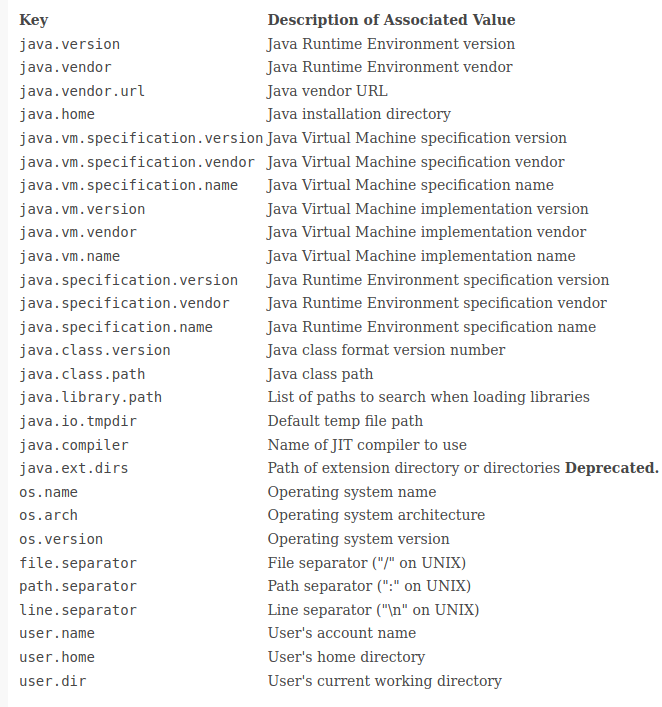

```
${ctx:loginId}
${map:type}
${filename}
${date:MM-dd-yyyy}
${docker:containerId}
${docker:containerName}
${docker:imageName}
${env:USER}
${event:Marker}
${mdc:UserId}
${java:runtime}
${java:vm}
${java:os}
${jndi:logging/context-name}
${hostName}
${docker:containerId}
${k8s:accountName}
${k8s:clusterName}
${k8s:containerId}
${k8s:containerName}
${k8s:host}
${k8s:labels.app}
${k8s:labels.podTemplateHash}
${k8s:masterUrl}
${k8s:namespaceId}
${k8s:namespaceName}
${k8s:podId}
${k8s:podIp}
${k8s:podName}
${k8s:imageId}
${k8s:imageName}
${log4j:configLocation}
${log4j:configParentLocation}
${spring:spring.application.name}
${main:myString}
${main:0}
${main:1}
${main:2}
${main:3}
${main:4}
${main:bar}
${name}
${marker}
${marker:name}
${spring:profiles.active[0]
${sys:logPath}
${web:rootDir}
```